# Junior Dev Talent

Overview - to complete

**View the live site [here](https://junior-dev-talent.herokuapp.com/)**

___
# Table of Contents 

1. [User Experience (UX)](#ux) 
    i.  [Strategy](#strategy) 
    ii. [Scope](#scope) 
    iii. [Structure](#Structure) 
    iv. [Skeleton and technical design](#skeleton) 
    v. [Surface](#surface) 
      
2. [Features](#features) 
    i. [Current Features](#features-existing) 
    ii. [Features to implement](#features-toimplement) 

3. [Testing](#testing) 

    i. [User Stories/feature testing](#user-stories-testing) 
    ii.  [Automated testing](#automated-testing) 
    iii.  [Known issues during development and testing](#known-issues) 
    iv. [Validation testing  ](#validation-testing) 
    v. [Javascript testing](#js-testing) 
    vi. [Unfixed bugs](#unfixed-bugs) 
4. [Deployment](#deployment) 
5. [Technologies Used](#technology-used) 
6. [Credits](#credits) 
7. [Acknowledgements](#acknowledgements) 

# 1. User Experience (UX)  
### **Project goals:**

### **Site owner goal:**

### **User goals:**
---

## i. Strategy 

## User stories
### **1. Functionality across site(EPIC)**

1.1 As a **site user** I can **intuitively navigate the site** so that **the layout of the site is consistent**

1.2 As a **site user** I can **click on the navigation bar** so that **I can select pages to view**

1.3 As a **site user** I can **see a link in the footer to the site’s Facebook Business Page**, so that **I can follow the company on Facebook**

1.4 As a **site user** I can **subscribe to get the newsletter**, so that **I can keep up to date with the company**

1.5 As a **site user** I can **view the sites privacy policy**, so that **i can read more about the sites policy**

1.6 As a **site user** I can **view the sites Terms of use policy**, so that **i can read more about the terms of use** 

### **2.The home page(EPIC)**

2.1 As a **site user** I can **view the home page** so that **I can learn more about the website and its purpose**

2.2 As a **site user** I can **click on get hired** so that **I can learn more about the site and update my profile**

2.2 As a **site user** I can **click on forum card** so that **I can learn more about the service chosen and goto the forum**

2.3 As a **site user** I can **click on Growth hub** so that **I can learn more about the service chosen and go to the shop**

2.4 As a **site user** I can **click on the talent center** so that **I can learn more about the service chosen and register**

### **3. Account management(EPIC)**

**My Account**

3.1. As a **site user** I can **sign up** so that **I have a role-based login and community functionality**

3.2 As a **site user** I can **receive a welcome email** so that **I know that I have signed up correctly and feel like a valued user**

3.3 As a **site user** I can **login with my username and password** so that **I can access the sites full functionality**

3.4 As a **logged in site user** I can **change my password** so that **I can stay secure**

3.5 As a **site user** I can **reset my password** so that **I can stay secure**

3.6 As a **logged-in site user** I can **log out of my account** so that **other users cannot access my account**

3.7 As a **site user** I can **see the current logged-in state** so that **I know if I can access logged in functionality**

**My profile**

3.8: As a **logged-in site user** I can **view my profile and see clearly what fields i haven't completed so i have a greater chance for hiring managers to view all my information about myself**

3.9. As a **logged-in site user** I can **update my profile** so that **i can change information about myself**

3.10. As a **logged-in site user** I can **delete my account** so that **my account is deleted and no longer have access to the functionality**

3.11. As a **logged-in site user** I can **add a skill** so that **i can add a skill to my profile**

3.12. As a **logged-in site user** I can **update a skill** so that **i can update the name of the skill on my profile**

3.13. As a **logged-in site user** I can **delete a skill** so that **i can delete the name of the skill on my profile**

3.14: As a **logged-in site user /hiring manager user** I can **view my Default billing information: Full name, Street Address 1, Street Address 2, Town or City, County, Postal Code, Country, phone number and email address**

3.15: As a **logged-in site user /hiring manager user** I can **view my order history(Order Number, Date, Items and Order Total)**

3.16: As a **logged-in site user /hiring manager user** I can **click on an order number** to view the order information 

3.17: As a **logged-in site user /hiring manager user** I can **view my order history(Order Number, Date, Items and Order Total)**

3.18: As a **logged-in site user /hiring manager user** I can **click on an order number** to view the order information 

3.19. As a **site user** who is **directed to a non-existent page or resource**, I can **redirected to the relevant error page**

### **4. Forum(EPIC)**  

4.1 As a **site user** I can **view the room topics** so I can **select a room of interest**

4.2 As a **logged-in site user** I can **view a list of posts by room** so that **I can select a post that interests me and view user comments**

4.3 As a **logged-in site user** I can **view a paginated list of posts** so that my **screen doesn't get overpopulated with posts**

4.4 As a **logged-in site user** I can **click on a post** so that **I can read the full article and related comments**

4.5 As a **logged-in site user** I can **create a new post** so that **I can post content on the site for other users to view**

4.6 As a **logged in site user (owner of post)** I can **edit a post (subject header /text body)** so that I can change the content if required

4.7 As a **logged-in site user (owner of post)** I can **delete a post that I have posted** so that **I can take content off the website**

4.8 As a **logged-in site user** I can **leave comments on a post** so that **I can take an active role in the forum (be involved in the conversation/express my opinion)**

4.9 As a **logged in site user(owner of comment)** I can **edit a comment** so that I can change the content if required

4.10 As a **logged-in site user(owner of comment)** I can **delete a comment that I have posted** so that **I can take content off the website**

4.11 As a **logged-in site User(owner of comment)**, I can **view a paginated list of comments** so that **my screen doesn't get overpopulated with comments**

4.12. As a **site user** who is **directed to a non-existent page or resource**, I can **redirected to the relevant error page**

### **5. E-commerce-Products(EPIC)**   
5.1. As a **site user** I can **click on categories to view** so that **i can view products by courses, mentor programmes and events**

5.2. As a **site user** I can **click on a product** so I can **view learn more about the product**

5.3. As a **site user** I can **add the product to my basket** so that **i can make a purchase**

5.4. As a **site user** I can **search products by name so I can **view products that interest me**

5.5. As a **site user** I can **paginate search products** so I **can view a paginated list of products so they don’t over populate the page**

5.6. As a **site user** I can **sort the products list by category, alphabetically**  so that **i can quickly find the product I seek**

5.7. As a **site user** who is **directed to a non-existent page or resource**, I can **redirected to the relevant error page**

### **6. Basket(EPIC)**

6.1. As a **site user** I can **always see the total price of my basket in the navigation bar, so that I know what the total cost will be when on the products page**

6.2. As a **site user** i can **adjust the quantity of the product chosen after adding it to the shopping basket**

6.3. As a **site user** I can **view the products added to my basket by clicking the basket icon or by adding an item to the basket**

6.4. As a **site user** I can **click on Proceed to Checkout, so that I can purchase the items in my basket**

6.5. As a **site user** who is **directed to a non-existent page or resource**, I can **redirected to the relevant error page**

### **7. Checkout(EPIC)**

7.1. As a **site user** i can **review my basket before i pay , so that i can change my mind or proceed with order**

7.2. As a **logged in site user** i can **complete my billing details so my records are correct**

7.3. As a **logged-in site user** i can **update and save my billing details so for future purchases they are completed**

7.4. As a **logged-in site user** i can **enter my card details on the checkout page**, so that **I can make the desired purchase**

7.5. As a **logged-in site user** I am **informed of whether my purchase was successful or not via the Order Successful page, as well as via an email sent upon order confirmation**

7.6. As a **site user** who is **directed to a non-existent page or resource**, I can **redirected to the relevant error page**

### **8.Talent center(EPIC)**

8.1. As a **site user,** I can **register** so that **i can access the talent center to view candidate profiles**

8.2. As a **employer site user** I can **click on talent center** so I can **view profiles that interest me**

8.3. As a **employer site user** I can **search profiles by skill** so I **can view junior developers**

8.4. As a **employer site user** I can **view candidates by date joined**  so that **i can quickly junior developers by new and old**

8.5. As a **employer site user** I can **view candidates linkedin /github**  so that **see more information about them**

8.6. As a **employer site user** I can **download a developers CV**  so that **read their experience**

8.7. As a **employer site user** I can **Contact a developer directly**  so that **i can contact them about a job**

### **9. Site admin(EPIC)**

**Forum**

9.1. As a **site admin** I can **create a room topic** so that **I can manage the site content**

9.2. As a **site admin** I can **update a room topic** so that **I can manage the site content**

9.3. As a **site admin** I can **delete a room topic** so that **I can manage the site content**

9.5. As a **site admin** I can **Manage posts in the django admin area ** so that **I can manage the site content**

9.6. As a **site admin** I can **Manage comments in the django admin area ** so that **I can manage the site content**

**Shop**

9.7. As a **site admin** I can **create a product** so that **I can manage the site content**

9.8. As a **site admin** I can **update a product** so that **I can manage the site content**

9.9. As a **site admin** I can **delete a product** so that **I can manage the site content**

**Profiles**

9.10. As a **site admin** I can **Manage Profiles in the django admin area ** so that **I can manage the site content**

9.11. As a **site admin** I can **Manage skills in the django admin area ** so that **I can manage the site content**

### **10. Authentication and error handling(EPIC)**

10.1. As a **site user** who is **directed to a non-existent page or resource**, I can **redirected to the relevant error page**

10.2. As a **site admin** i want **non-logged users not to have access to forum( only access to logged in users), and talent center( access only to hiring managers)

10.3. As a **site admin** i want **users only access their profile with products brought**

to delete?
future feature
10.7. As a **site admin** I can **create a subscriptions model and content** so that **I can manage the site content**

10.8. As a **site admin** I can **update subscriptions model and content** so that **I can manage the site content**

10.9. As a **site admin** I can **delete subscriptions model and content** so that **I can manage the site content**

[Table of Contents ](#home)
___
## ii. Scope 

## Strategy Trade-offs
I have rated the features on a scale of 1 to 5 in terms of importance (how important is it for the project now) and viability (how realistic is that we can implement a solution)

To achieve the strategy goals, the following features highlighted in green will be implemented to create a minimal viable product due to the timescale and technical ability. The additional features in red will be added at a further stage

 

Click here to view strategy trade offs

---

## iii. Structure  

## Website templates
I have structured the templates into the following files and have used the base template throughout the site to give a consist user experience

| Page                                                                                                                                     | Description                                                                                                                                          | Accessible                                                                                                                          | HTML                                   |
| ---------------------------------------------------------------------------------------------------------------------------------------- | ---------------------------------------------------------------------------------------------------------------------------------------------------- | ----------------------------------------------------------------------------------------------------------------------------------- | -------------------------------------- |
| Base template                                                                                                                            | The base template is used in all templates to give the user a consistent experience and gives the user the ability to navigate the site seamlessly                      |                                                                                                                                     | in junior-dev-talent/templates/        |
|                                                                                                                                          | The base template consists of a navigation bar                                                                                                       | Non logged in users & logged in                                                                                                     | base.html                              |
|                                                                                                                                          | a Junior developer talent logo on the left - user can select to go back to home page on large screens                                                |                                                                                                                                     |                                        |
|                                                                                                                                          | a search bar with site navigation links below to direct users to the important parts of the site                                                     |                                                                                                                                     | includes/mobile-top-header.html        |
|                                                                                                                                          | a profile icon account functionality - see below functionality                                                                                       |                                                                                                                                     | includes/nav-menu.html                 |
|                                                                                                                                          | Shopping basket which displays a running total of the contents in the basket                                                                         |                                                                                                                                     | includes/search.html                   |
|                                                                                                                                          |                                                                                                                                                      |                                                                                                                                     |                                        |
|                                                                                                                                          | The footer consists of the following links                                                                                                           |                                                                                                                                     |                                        |
|                                                                                                                                          | A field for users to enter their email address to subscribe to the sites newsletter                                                                  |                                                                                                                                     |                                        |
|                                                                                                                                          | Terms of use policy modal                                                                                                                            | Non logged in users & logged in                                                                                                     | includes/terms\_of\_use.html           |
|                                                                                                                                          | Privacy policy modal                                                                                                                                 | Non logged in users & logged in                                                                                                     | includes/privacy\_policy.html          |
|                                                                                                                                          | Facebook link - open in a new tab                                                                                                                    |                                                                                                                                     |                                        |
|                                                                                                                                          |                                                                                                                                                      |                                                                                                                                     |                                        |
| Account functionality                                                                                                                    | My account icon - Allauth templates                                                                                                                  |                                                                                                                                     | in junior-dev-talent/templates/allauth |
| Sign in                                                                                                                                  | A user can login with a valid username and password                                                                                                  | Non logged in users & logged in                                                                                                     | login.html                             |
| Sign out                                                                                                                                 | A sign out link is provided under the account icon                                                                                                   | Logged in users                                                                                                                     | logout.html                            |
|                                                                                                                                          |                                                                                                                                                      |                                                                                                                                     |                                        |
| Forgot password                                                                                                                          | A user can reset their password                                                                                                                      | non-logged in users                                                                                                                 | password\_reset.html                   |
|                                                                                                                                          | Confirmation that an email has been sent to the user to reset password                                                                               |                                                                                                                                     | password\_reset\_done.html             |
|                                                                                                                                          | Page consists of a message to let the  user to change their password                                                                                 |                                                                                                                                     | password\_reset\_from\_key.html        |
|                                                                                                                                          | Allows the user to enter a new password                                                                                                              |                                                                                                                                     | password\_set.html                     |
|                                                                                                                                          | Page consists of a message to let the user know password has changed                                                                                 |                                                                                                                                     | password\_reset\_from\_key\_done.html  |
| Change password                                                                                                                          | Page consists of a message to let the  user to change their password                                                                                 | logged in users                                                                                                                     |                                        |
|                                                                                                                                          |                                                                                                                                                      |                                                                                                                                     |                                        |
| Sign up                                                                                                                                  | Allows a user to enter their details to signup to the site                                                                                           | Non logged in users                                                                                                                 | signup.html                            |
|                                                                                                                                          | Page consists of a message to let the  user the site has sent an email for verification                                                              |                                                                                                                                     | verification\_sent.html                |
|                                                                                                                                          | Welcome email                                                                                                                                        |                                                                                                                                     |                                        |
|                                                                                                                                          |                                                                                                                                                      |                                                                                                                                     |                                        |
|                                                                                                                                          |                                                                                                                                                      |                                                                                                                                     |                                        |
| Home                                                                                                                                     | The home page consists of                                                                                                                            | Non logged in users & logged in                                                                                                     | In home/templates                      |
|                                                                                                                                          | A hero image of a junior developer coding                                                                                                            |                                                                                                                                     | home/index.html                        |
|                                                                                                                                          | 4 "cards" to explain what the site is about                                                                                                          |                                                                                                                                     |                                        |
|                                                                                                                                          | Users can click on these cards to open a modal to explain each section of the site                                                                   |                                                                                                                                     |                                        |
|                                                                                                                                          | Forum modal                                                                                                                                          | Non logged in users & logged in                                                                                                     | includes/forum.html                    |
|                                                                                                                                          | Gethired modal                                                                                                                                       | Non logged in users & logged in                                                                                                     | includes/gethired.html                 |
|                                                                                                                                          | Growthhub modal                                                                                                                                      | Non logged in users & logged in                                                                                                     | includes/growthhub.html                |
|                                                                                                                                          | Talent modal                                                                                                                                         | Non logged in users & logged in                                                                                                     | includes/talent.html                   |
|                                                                                                                                          |                                                                                                                                                      |                                                                                                                                     |                                        |
| Forum App                                                                                                                                | A user can use the forum to collaborate with other developers on topics                                                                              |                                                                                                                                     | In forum/templates/forum               |
| Topic (Create)                                                                                                                           | A superuser can add a topic                                                                                                                          | Superuser only                                                                                                                      | topic\_form.html                       |
| Topic detail (Read)                                                                                                                      | A user can view a topic                                                                                                                              | Non logged in users & logged in                                                                                                     | forum.html                             |
| Topic post(update)                                                                                                                       | A superuser can update a topic                                                                                                                       | Superuser only                                                                                                                      | topic\_form.html                       |
| Topic post(delete)                                                                                                                       | A superuser can delete topic                                                                                                                         | Superuser only                                                                                                                      | delete\_post.html                      |
|                                                                                                                                          |                                                                                                                                                      |                                                                                                                                     |                                        |
| Post list (Read)                                                                                                                         | A user can  view a list of 5 posts filtered by topic, paginate by 6                                                                                  | Logged in users                                                                                                                     | postlist.html                          |
|                                                                                                                                          |                                                                                                                                                      |                                                                                                                                     | pagination.html                        |
| Post (Create)                                                                                                                            | A user can add a post, by topic selection                                                                                                            | Logged in users                                                                                                                     | post\_form.html                        |
| Post detail (Read)                                                                                                                       | A user can view a post                                                                                                                               | Logged in users                                                                                                                     | post\_detail.html                      |
| Update post(update)                                                                                                                      | A user can update their post                                                                                                                         | Logged in user, owner of post                                                                                                       | update\_post.html                      |
| Delete post(delete)                                                                                                                      | A user can delete their post                                                                                                                         | Logged in user, owner of post                                                                                                       | delete\_post.html                      |
|                                                                                                                                          |                                                                                                                                                      |                                                                                                                                     |                                        |
| Comments(Add)                                                                                                                            | A user can add a comment                                                                                                                             | Logged in users                                                                                                                     | commentform.html                       |
| Comments(Read)                                                                                                                           | A user can view created ( oldest first), Paginate by 6                                                                                               | Logged in users                                                                                                                     | post\_detail.html                      |
|                                                                                                                                          |                                                                                                                                                      |                                                                                                                                     | pagination.html                        |
| Comments(Delete)                                                                                                                         | A user can delete their comment                                                                                                                      | Logged in user, owner of comment                                                                                                    | delete\_comment.html                   |
| Comments(Update)                                                                                                                         | A user can update their comment                                                                                                                      | Logged in user, owner of comment                                                                                                    | update\_comment.html                   |
|                                                                                                                                          |                                                                                                                                                      |                                                                                                                                     |                                        |
| Profile App                                                                                                                              |                                                                                                                                                      |                                                                                                                                     | in profiles/templates/profiles         |
| Account details(Create)                                                                                                                  | A user can create a profile by registering on the site, a signal creates the profile                                                                 | Non logged in user                                                                                                                  | templates/allauth/account/signup.html  |
| Account details(read)                                                                                                                    | A user can view their default account details                                                                                                        | Logged in user, user can only access their profile                                                                                  | account\_details.html                  |
| Account details(Update)                                                                                                                  | A user can update their default account details                                                                                                      | Logged in user, user can only update their profile                                                                                  | edit\_profile.html                     |
| Account details(delete)                                                                                                                  | A user can delete their account, signals will delete the user account/profile                                                                        | Logged in user, user can delete their profile                                                                                       | delete\_account.html                   |
|                                                                                                                                          |                                                                                                                                                      |                                                                                                                                     |                                        |
| Profile (Create)                                                                                                                         | A user can create a profile by registering on the site, a signal creates the profile                                                                 | Non logged in user                                                                                                                  | templates/allauth/account/signup.html  |
| Profile (Read)                                                                                                                           | A user can view their profile details                                                                                                                | Logged in user, user can only access their profile                                                                                  | display\_profile.html                  |
| Profile (update)                                                                                                                         | A user can update their profile details                                                                                                              | Logged in user, user can only update their profile                                                                                  | edit\_profile.html                     |
| Profile (Delete)                                                                                                                         | A user can delete their account, signals will delete the user account/profile                                                                        | Logged in user, user can delete their profile                                                                                       | delete\_account.html                   |
|                                                                                                                                          |                                                                                                                                                      |                                                                                                                                     |                                        |
| Skill (Create)                                                                                                                           | A user can add skills to their profile                                                                                                               | Logged in user, user can create a skill                                                                                             | skill\_form.html                       |
| Skill (Read)                                                                                                                             | A user can view skills on their profile                                                                                                              | Logged in user, user can only view their skills                                                                                     | display\_profile.html                  |
| Skill(Update)                                                                                                                            | a user can update skills on their profile                                                                                                            | Logged in user, user can only update their skill                                                                                    | skill\_form.html                       |
| Skill(Delete)                                                                                                                            | a user can delete a  skill on their profile                                                                                                          | Logged in user, user can only delete their skill                                                                                    | delete\_skill.html                     |
|                                                                                                                                          |                                                                                                                                                      |                                                                                                                                     |                                        |
| Talent center                                                                                                                            | Hiring managers can view user profiles and email them directly                                                                                       |                                                                                                                                     |                                        |
| Talent center(list view)                                                                                                                 | A hiring manager can search profiles by keyword, paginate by 6                                                                                       | Logged in & registered as a hiring manager                                                                                          | talent-center.html                     |
|                                                                                                                                          |                                                                                                                                                      |                                                                                                                                     | pagination.html                        |
| Talent center(Detailed view)                                                                                                             | Display candidates profile                                                                                                                           | Logged in & registered as a hiring manager                                                                                          | talent\_center\_detail.html            |
| Talent center(contact candidate form)                                                                                                    | A hiring manager can email a candidate                                                                                                               | Logged in & registered as a hiring manager                                                                                          | contact.html                           |
| Talent Center(Benefits)                                                                                                                  | Explains the benefits of registering as a hiring manager                                                                                             | Non logged in users & logged in. Not registered as a hiring manager                                                                 | subscription.html                      |
| Talent Center(Register)                                                                                                                  | Register as a hiring manager                                                                                                                         | Non logged in users & logged in. Not registered as a hiring manager                                                                 | register\_user\_type.html              |
|                                                                                                                                          |                                                                                                                                                      |                                                                                                                                     |                                        |
| Products app                                                                                                                             |                                                                                                                                                      |                                                                                                                                     |                                        |
| Products(list view)                                                                                                                      | Users can view a summary of products, they can filter by courses, events or mentorships and sort by price, name and category                         | Non logged in users & logged in.                                                                                                    | products.html                          |
| Products( Create)                                                                                                                        | A superuser can add a product to the store                                                                                                           | Superuser only                                                                                                                      | add\_product.html                      |
| Product(Read)                                                                                                                            | Users can view more information about the product, paginate by 6                                                                                     | Non logged in users & logged in.                                                                                                    | product\_detail.html                   |
|                                                                                                                                          |                                                                                                                                                      | pagination.html |                                        |
| Product(Update)                                                                                                                          | Users can update the product detail                                                                                                                  | Superuser only                                                                                                                      | update\_product.html                   |
| Product(Delete)                                                                                                                          | Users can delete a product                                                                                                                           | Superuser only                                                                                                                      | delete\_product.html                   |
|                                                                                                                                          |                                                                                                                                                      |                                                                                                                                     |                                        |
| Basket App                                                                                                                               | A user adds an item to their basket and the contents goes into their "basket"                                                                        | Non logged in users & logged in                                                                                                     | in basket/templates/basket             |
|                                                                                                                                          | Display summary of products in the users basket                                                                                                      |                                                                                                                                     | basket.html                            |
|                                                                                                                                          | Display basket total                                                                                                                                 |                                                                                                                                     | basket\_total.html                     |
|                                                                                                                                          | Display check out buttons                                                                                                                            |                                                                                                                                     | checkout\_buttons.html                 |
|                                                                                                                                          | Display product image or default image for no image                                                                                                  |                                                                                                                                     | product\_image.html                    |
|                                                                                                                                          | Display product name                                                                                                                                 |                                                                                                                                     | product\_info.html                     |
|                                                                                                                                          | Display + & - buttons to increase and decrease the quantity of product                                                                               |                                                                                                                                     | quantity\_form.html                    |
|                                                                                                                                          |                                                                                                                                                      |                                                                                                                                     |                                        |
| Checkout App |                                                                                                                                                      |                                                                                                                                     | in checkout/templates/checkout         |
|                                                                                                                                          | User add their invoicing details, option to save their details and display them (if they are logged in)so they don't need to re-enter them each time | Non logged in users & logged in                                                                                                     | checkout.html                          |
|                                                                                                                                          | Order confirmation when displayed when payment has been successful                                                                                   | Non logged in users & logged in                                                                                                     | checkout\_success.html                 |
|                                                                                                                                          |                                                                                                                                                      |                                                                                                                                     |                                        |
|                                                                                                                                          |                                                                                                                                                      |                                                                                                                                     |                                        |
|                                                                                                                                          |                                                                                                                                                      |                                                                                                                                     |                                        |
| Error pages                                                                                                                              |                                                                                                                                                      |                                                                                                                                     | in junior-dev-talent/templates/errors  |
| 404error page                                                                                                                            | Page consists of a message to let the user know that the url doesn't exist                                                                           | Non logged in users & logged in                                                                                                     | 404error.html                          |
| 500 error page                                                                                                                           | Page consists of a message to let the user know that their has been an server error                                                                  | Non logged in users & logged in                                                                                                     | 500error.html                          |

---
## Code Structure 
The code is spilt using the Django framework into the following apps, folders and files
### Junior_dev_talent app (main project):
-	settings.py - Settings
-	 urls.py - Website urls

### Forum app (this app contains the functionality for the community forum)
-	Admin.py  - used to display and customize the models in the Django admin panel
-	Forms.py- used to customizing fields for the form to access
-   Widgets.py - The widget handles the rendering of the HTML, and the extraction of data from a GET/POST dictionary that corresponds to the widget.
-	Models.py – details all the model and every attribute 
-	Signals.py - signals allow certain senders to notify a set of receivers that some action has taken place 
-	Test_forms.py -automated testing for forms
-	Test_models.py  automated testing for models
-	Test_views.py automated testing for views
-	Views.py –views are Python functions or classes that receive a web request and return a web response. All of the logic is held
-   Urls.py - Website urls related to the forum app
    ### Folders
-	Static folder– custome css file

### Basket app (this app contains the functionality for the basket app in the e-commerce store)
-	Test_views.py automated testing for views
-	Views.py –views are Python functions or classes that receive a web request and return a web response. All of the logic is held
-   Urls.py - Website urls related to the basket app
-   Context.py - used to access global variables across the site for the basket

    ### Folders
-	Templates tags– basket_tools.py - used to return the total of the basket

### Checkout app (this app contains the functionality for the checkout app in the e-commerce store)
-   Admin.py  - used to display and customize the models in the Django admin panel
-	Forms.py- used to customizing fields for the form to access

-	Models.py – details all the model and every attribute 
-	Signals.py - signals allow certain senders to notify a set of receivers that some action has taken place 
-	Test_forms.py -automated testing for forms
-	Test_models.py  automated testing for models
-	Test_views.py automated testing for views
-	Views.py –views are Python functions or classes that receive a web request and return a web response. All of the logic is held
-   Urls.py - Website urls related to the forum app
-   Signals.py - used on save or delete to preform an update total function on the order
-   Webhook_handler.py - sends data from stripe to users account with order details
-   Webhooks -Stripe uses webhooks to notify our application when an event happens in your account.

    ### Folders
-	Static folder– custom css file

### Products app (this app contains the functionality for the products app in the e-commerce store)
-   Admin.py  - used to display and customize the models in the Django admin panel
-	Forms.py- used to customizing fields for the form to access
-	Models.py – details all the model and every attribute 
-	Signals.py - signals allow certain senders to notify a set of receivers that some action has taken place 
-	Test_forms.py -automated testing for forms
-	Test_models.py  automated testing for models
-	Test_views.py automated testing for views
-	Views.py –views are Python functions or classes that receive a web request and return a web response. All of the logic is held
-   Urls.py - Website urls related to the forum app
-   Widgets.py - The widget handles the rendering of the HTML, and the extraction of data from a GET/POST dictionary that corresponds to the widget.

    ### Folders
-	Templates tags– product_tools.py 

### Profiles app (this app contains the functionality for the profiles app for the talent center and user profile information)
-   Admin.py  - used to display and customize the models in the Django admin panel
-	Forms.py- used to customizing fields for the form to access
-	Models.py – details all the model and every attribute 
-	Signals.py - signals allow certain senders to notify a set of receivers that some action has taken place 
-	Test_forms.py -automated testing for forms
-	Test_models.py  automated testing for models
-	Test_views.py automated testing for views
-	Views.py –views are Python functions or classes that receive a web request and return a web response. All of the logic is held
-   Urls.py - Website urls related to the forum app
-   Widgets.py - The widget handles the rendering of the HTML, and the extraction of data from a GET/POST dictionary that corresponds to the widget.

    ### Folders
-	Static folder– custom css file

### Home app (this app contains the functionality for the home app on the home page)
-	Test_views.py automated testing for views
-	Views.py –views are Python functions or classes that receive a web request and return a web response. All of the logic is held
-   Urls.py - Website urls related to the basket app

### Folders 
-	Media folder – Media files uploaded by users
-	Static folder– css, images and Javascript files
-	Staticfiles - Django. contrib. staticfiles collects static files from each applications into a single location that can easily be served in production.
-   Utils  - extends a python file code base  - pagination 
-	Templates folder: 
    - all html files 
    - allauth(django authentication) 
    -	Documentation - contains all files related to the readme
### Files
-	manage.py: Main python file for starting the website
-	custom_storage.py: AWS Boto3 configuration
-	Procfile: To run the application
-	Requirements.txt: Containing the python libraries installed
-	Db.sqlite3 – Database for development
-	README.md: Readme documentation

[Table of Contents ](#home)

---
# Database
A relational database was used for this project.
During development SQLite DB was used and for production Postgres was used as the main database, and for deployment all data was migrated to Heroku Postgres.

## Data Schema

Click here to view the data schema for Junior Dev Talent

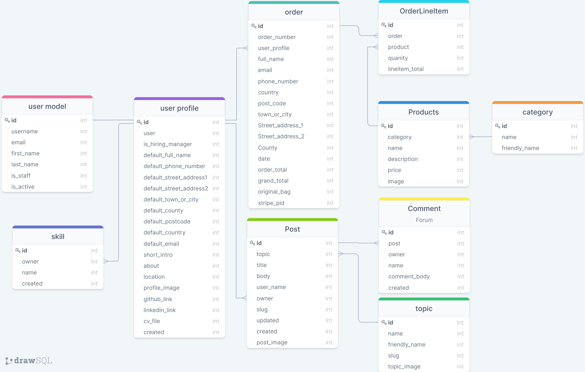

 
---
 

## Models
The following models were created to represent the database model structure for the website
### User Model – One to many relationship - A user can have one profile
- The User model contains information about the user. It is part of the Django allauth library
- The model contains the following fields: username, password, first_name, last_name, email, is_staff, is_active, is_superuser, last_login, date_joined

### User profile Model – one  to one relationship – A userprofile can have one user
- The user profile model contains information about user
- Below are the fields and attribute for the uesr profile model

Click here to view user profile model part 1

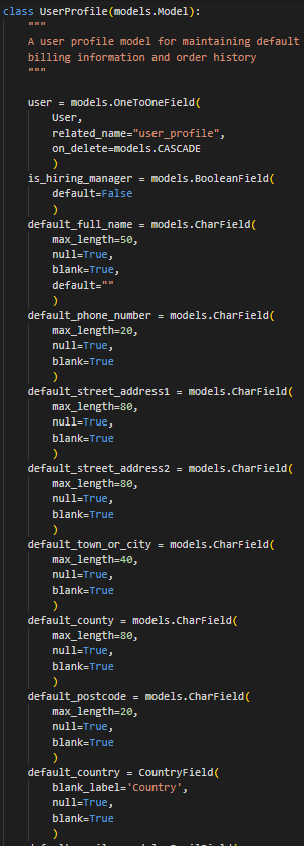

Click here to view user profile model part 2

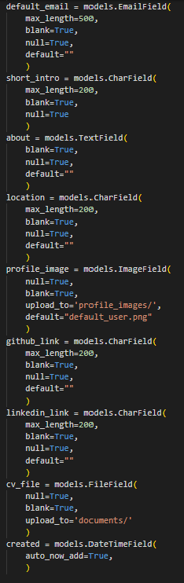

 

### Skill Model – one  to many relationship – A userprofile can have many skills
- The skill model contains information about skill
- Below are the fields and attribute for the skill model

Click here to view skill model

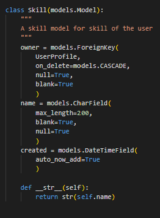

 

### Order Model

One to many relationship -a user profile can have many orders
- The order model contains information about the user details, and costs.
- Below are the fields and attribute for the Order model

Click here to view order model part 1

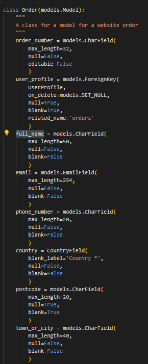

Click here to view order model part 2

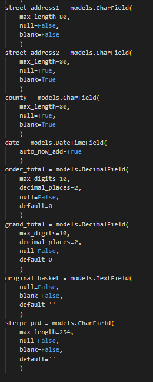

 

### OrderLineItem Model
Relationships
- an orderlineitem can have one user profile
- an orderlineitem can have many products

- The orderlineitem model contains information about each product that is ordered by the user in their order.
- Below are the fields and attribute for the Order model

Click here to view orderlineitem model 

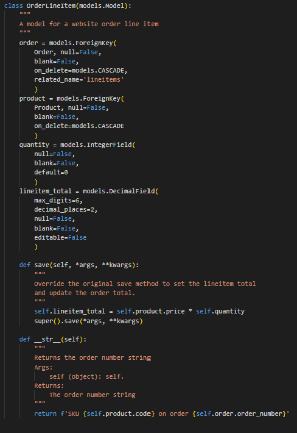

 

### Product Model

many to one relationship -a category can have many products
- The product model contains information about each product 
- Below are the fields and attribute for the product model

Click here to view product model 

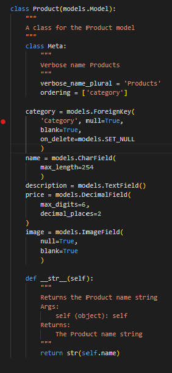

 

### Product category Model

- The category model contains information about each category 
- Below are the fields and attribute for the product model

Click here to view category model 

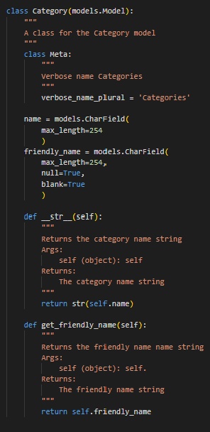

 

### Post Model 
Relationships
- a post can have many comments
- a post can have one topic
- a post can have one user

 

- The post model contains fields about the post.
- This model captures the user and topic  to determine who made the post and the topic name.  These are foreign-keys
- Below are the fields and attribute for the Post model

Click here to view post model

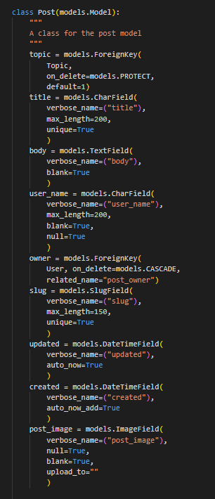

 

### Comment Model– many to one relationship – Many  comments can have one post
-	The comment model contains fields for the commenting functionality based on a post
-	This model captures post. This is a foreign-key
-	Below are the fields and attribute for the comment model

Click here to view comment model

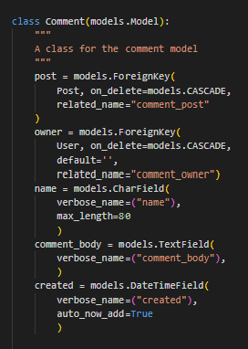

 

### Definitions
-	models.ManytoManyField -A ManyToMany field - is used when a model needs to reference multiple instances of another model. E.g. A user can vote on many posts and votes can have many posts. 

- Foreign key - Foreign Key is a ORM(Object-Relational Mapper) field-to-column mapping for creating and working with relationships between tables in relational databases.
e.g.on the Post model topic is the Foreign Key to the Topic model

-	On_delete cascade – delete the rows from the child table automatically, when the rows from the parent table are deleted.  E.g. if you delete a post, all of the comments and votes are related to the post will be deleted

-	On_delete=models. PROTECT – do not delete this field in the related model

-	Default – gives a default value

-	Blank = True – allows the field to be blank, False means they cannot be blank

-	Null – store empty values as NULL in the database. Default is False

-	Max_length – max length of characters a user can enter

-	Unique – the value needs to be unique in the database

-	SlugField - A slug field is used to store and generate valid URLs for your dynamically created web pages. It will add”-“ where there are spaces in the url

-	Related name - This is used when one record of a model A is related to exactly one record of another model B.  e.g. post field in the vote model is the same as the Foreignkey so we give it a related name “vote_post”

-	Auto_now_add=True – gives the field the date when it was created

-	Class meta - l Meta is basically the inner class of your model class. Model Meta is basically used to change the behavior of your model fields like changing order options,verbose_name and lot of other options

-	Verbose name -  is a human-readable name for the field. If the verbose name isn't given, Django will automatically create it using the field's attribute name, converting underscores to spaces

-	Ordering = ascending or descending

-	__str__(self)    return str(self.title) converts the object into a string for the admin page

-	get_absolute_url(self return f”/topic/{self.post.id}- converts the object in to a url string  “topic/post/1” for example

[Table of Contents ](#home)
---

## iv. Skeleton / Technical design  
I used Balsamiq to create wireframes for my project in order to plan out the layout of the interface, navigation and information design of the site on desktop, tablets and mobile devices.

Home page
Page | Wireframe | 
------------ | ------------- 
Home |[SM](readme/images/balsamiq/home_sm.png)
Home |[MD](readme/images/balsamiq/home_md.png)
Home |[LG](readme/images/balsamiq/home_lg.png)
Nav bar |[SM/MD](readme/images/balsamiq/nav_bar_sm_md.png)
Nav bar |[LG](readme/images/balsamiq/home_lg.png)
Home page modals |[SM](readme/images/balsamiq/home_modal_sm.png)
Home page modals |[MD](readme/images/balsamiq/home_modal_md.png)
Home page modals |[LG](readme/images/balsamiq/home_modal_lg.png)

Community Forum
Page | Wireframe | 
------------ | ------------- 
Topic-Admin links |[SM/MD/LG](readme/images/balsamiq/communityforum_topics_admin_add_edit_delete_links.png)
Add Topic(create) |[SM/MD/LG](readme/images/balsamiq/communityforum_add_topic.png)
Topics(read) |[SM/MD](readme/images/balsamiq/communityforum_topics_sm_md.png)
Topics(read) |[LG](readme/images/balsamiq/communityforum_topics_lg.png)
Update Topic(update) |[SM/MD/LG](readme/images/balsamiq/communityforum_update_topic.png)
Delete Topic(delete) |[SM/MD/LG](readme/images/balsamiq/communityforum_delete_topic.png)
Create Post(create) |[SM/MD/LG](readme/images/balsamiq/create_post_sm_md_lg.png)
Post Detail(read) |[MD/LG](readme/images/balsamiq/communityforum_post_detail_md_lg.png)
Post Detail(read) |[SM](readme/images/balsamiq/communityforum_post_detail_sm.png)
Post(update) |[SM/MD/LG](readme/images/balsamiq/edit_post_sm_md_lg.png)
Delete Post(delete) |[SM/MD/LG](readme/images/balsamiq/delete_post_sm_md_lg.png)
Post List(read) |[SM/MD/LG](readme/images/balsamiq/communityforum_postlist_sm_md_lg.png)
Comment (Create) |[SM/MD/LG](readme/images/balsamiq/create_comment_sm_md_lg.png)
Comment detail(read) |[MD/LG](readme/images/balsamiq/communityforum_post_detail_md_lg.png)
Comment detail(read) |[SM](readme/images/balsamiq/communityforum_post_detail_sm.png)
Comment (update) |[SM/MD/LG](readme/images/balsamiq/edit_comment_sm_md_lg.png)
Comment (Delete) |[SM/MD/LG](readme/images/balsamiq/delete_comment_sm_md_lg.png)

E-commerce
Products
Page | Wireframe | 
------------ | ------------- 
Product admin links |[SM/MD/LG](readme/images/balsamiq/ecommerce_admin_add_update_delete_product_link.png)
Add product(Create) |[SM/MD/LG](readme/images/balsamiq/ecommerce_add_product.png)
Update product(Update) |[SM/MD/LG](readme/images/balsamiq/ecommerce_edit_product.png)
Delete product(Delete) |[SM/MD/LG](readme/images/balsamiq/ecommerce_delete_product.png)
Product list(View) |[LG](readme/images/balsamiq/ecommerce_product_list_lg.png)
Product list(View) |[SM/MD](readme/images/balsamiq/ecommerce_product_list_sm_md.png)
Product list(View) |[XS](readme/images/balsamiq/ecommerce_product_list_xs.png)
Product detail(View) |[SM/MD/LG](readme/images/balsamiq/ecommerce_product_detail_sm_md_lg.png)
Product detail(View) |[XS](readme/images/balsamiq/ecommerce_product_detail_xs.png)

Shopping basket
Page | Wireframe | 
------------ | ------------- 
Shopping basket empty |[SM/MD/LG](readme/images/balsamiq/shopping_basket_empty.png)
Shopping basket with products |[SM](readme/images/balsamiq/shopping_basket_with_products_sm.png)
Shopping basket with products |[MD/LG](readme/images/balsamiq/shopping_basket_with_products_md_lg.png)

Checkout
Page | Wireframe | 
------------ | ------------- 
Checkout |[SM/MD](readme/images/balsamiq/checkout_lg.png)
Checkout |[LG](readme/images/balsamiq/checkout_lg.png)
Checkout success |[SM/MD/LG](readme/images/balsamiq/checkout_success_order_placed.png)

Profile and Account details
Page | Wireframe | 
------------ | ------------- 
Account detail |[MD/LG](readme/images/balsamiq/account_detail_md_lg.png)
Account detail |[SM](readme/images/balsamiq/account_detail_sm.png)
Edit Account detail |[MD/LG](readme/images/balsamiq/edit_account_details_sm_md_lg.png)
My Profile |[MD/LG](readme/images/balsamiq/my_profile_md_lg.png)
My Profile |[SM](readme/images/balsamiq/my_profile_sm.png)
Edit Profile |[SM/MD/LG](readme/images/balsamiq/edit_profile_sm_md_lg.png)

Page | Wireframe | 
------------ | ------------- 
Create skill(Create) |[SM/MD/LG](readme/images/balsamiq/create_skill_sm_md_lg.png)
Update skill(Update) |[SM/MD/LG](readme/images/balsamiq/update_skill_sm_md_lg.png)
Delete skill(Delete) |[SM/MD/LG](readme/images/balsamiq/delete_skill_sm_md_lg.png)

Talent Center
Page | Wireframe | 
------------ | ------------- 
Talent Center list |[SM](readme/images/balsamiq/talent_center_sm.png)
Talent Center list |[MD/LG](readme/images/balsamiq/talent_center_md.png)
Talent Center detail |[SM](readme/images/balsamiq/talent_center_detail_sm.png)
Talent Center detail |[MD/LG](readme/images/balsamiq/talent_center_detail_md_lg.png)
Register as a hiring manager|[SM/MD/LG](readme/images/balsamiq/talent_center_profile_type_sm_md_lg.png)
Talent Center benefits |[LG](readme/images/balsamiq/talent_center_subscription_lg.png)
Talent Center benefits |[MD/LG](readme/images/balsamiq/talent_center_subscription_md_lg.png)
Talent Center benefits |[SM](readme/images/balsamiq/talent_center_subscription_sm.png)

---
## v. Surface  
My goal is to build a platform inclusive and accessible to everyone, so therefore it should be aesthetically pleasing in a generic style.

### **Color Palette**
The colour palette website provided colour palette suggestions, from which I chose the defined colour palette below. 

Click here to view the hero image on the home page 

 

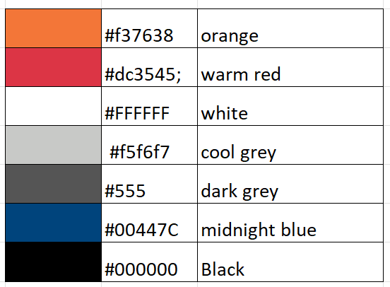

### **Typography**

The following font Roboto have been selected to ensure the text is easy to read, add value to the text, and invoke user to perceive a positive emotion from the text. The fonts chosen are generic and therefore should appeal to any demographic/user. It is rated as Google's best font.

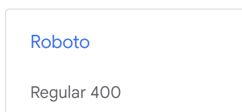

### **Imagery**
Likewise for the hero images on the home page I selected imagery aligned to software engineering, plus my colour palette to make the home page visually pleasing and eye catching whilst ensuring the styling throughout the platform is consistent
Please refer to further details in credits section for specific images used within the project

Click here to view hero image 1 on home page

 

Click here to view hero image 2 on home page

 

[Table of Contents ](#home)

---

# 2. Features 

## Existing features 

### **Feature 1 Navigation bar**

Navigation bar is featured on all pages at the top of the screen 
This section will allow the user to easily navigate from page to page across all devices without having to revert back to the previous page via 'back button' 

**Small and medium screen devices**

**Navigation icon**
- User can select from the dropdown from the menu “Home”, “Forum”, “Growth Hub” ,“Talent Center”

**Search icon**
- Under icon “Search” displayed
- User can select the icon and a search bar will appear under the icon with a placeholder "Search our growth hub store"

**Account icon**
- User can select from the dropdown menu - “Register” or “Login”

- *Non-Logged in user*
    - Under icon “Account”  will be displayed
    
- *Logged in user*
    - Under icon User name will be displayed
    - "Account"  will be displayed , If hiring manager is true in their profile
     
    - User can then select from the dropdown menu
    "My account" will be displayed, if hiring manager is true 

    or

    "My Profile" will be displayed, if hiring manager is false (normal user)

    "Change password" for all users

    "Logout" for all users

**Basket icon**
- Under icon, Total amount in GBP in basket is displayed

 

**Medium and larger screen devices** 

**Junior Dev Talent image**
- User can click to go back to the home page

**Search bar**
- Search bar displayed with a placeholder "Search our growth hub store"

**Account Icon**
- User can then select from the dropdown menu - “Register” or “Login”

- *Non-Logged in user*
    - Under icon “Account”  will be displayed
    
- *Logged in user*
    - Under icon “Full name” will be displayed if the user has completed the field in their profile
    - "Account"  will be displayed , If hiring manager is true in their profile
     
    - User can then select from the dropdown menu
    "My account" will be displayed, if hiring manager is true  
    or
    "My Profile" will be displayed, they are a normal user
    "Change password" for all users
    "Logout" for all users

**Basket Icon**
- Total amount in GBP in basket

___
### **Feature 2 Footer**
The footer is displayed at the bottom of the page, Privacy Policy, terms of use, plus facebook link and newsletter subscription 
The footer is valuable to the user as it provides important navigation options and encourages them to keep connected with the sites newsletter and facebook community 
**Responsive on all devices**  

**Small screen devices** 

Displayed on 1 row
- Subscribe to newsletter icon, description and input field for email address
- Facebook icon, describtion and link

Next row
- Privacy Policy terms and of use links

**Medium and larger screen devices** 

Displayed on 2 row, 1 column
- Subscribe to newsletter icon, description and input field for email address
- Facebook icon, description and link

Next row
- Privacy Policy
- Terms of use

___
### **Feature 3 Home page**
This section introduces the user to Junior Dev Talent with a hero image and 4 cards letting the user know the services the site provides

**Responsive on all devices**  

**The homepage consists**
- Hero image with a junior developer working at their computer
- 4 cards explaining each of the services of the site
    - Get hired, Forum, Growth Hub and Talent Center
    - **Small screen devices**
        - The cards will be stacked in one column
    - **medium screen devices**
        - The cards will be stacked in two column, 2 rows
    - **Large screen devices**
        - The cards will be in 1 column
- Hero image with a hiring manager shaking the hand of a candidate through a laptop

**Get Hired Modal** ( accessed from the home page "Get hired" card)
- Get hired modal displayed with a title, 3 cards and a call to action button "Start now"
    - **Small screen devices**
        - The cards will be stacked in one column
    - **Medium and large screen devices**
        - The cards will be stacked 1 row

    - User clicks on "Start Now", 
        - *Logged in users* - Update profile template is displayed
        - *Non-Logged in users* - Sign-in  template is displayed

**Forum Modal** ( accessed from the home page "Forum" card)
- Forum modal displayed with a title, 4 cards and a call to action button "Chat now"
    - **Small screen devices**
        - The cards will be stacked in one column
    - **Medium screen devices**
        - The cards will be stacked in two column, 2 rows
    - **Large screen devices**
        - The cards will be in 1 column

    - User clicks on Chat now, Forum template is displayed

**Growth Hub Modal** ( accessed from the home page "Growth hub" card)
- Growth Hub modal displayed with a title, 4 cards and a call to action button "Shop now"
    - **Small screen devices**
        - The cards will be stacked in one column
    - **Medium screen devices**
        - The cards will be stacked in two column, 2 rows
    - **Large screen devices**
        - The cards will be in 1 column

    - User clicks on Shop now, Growth hub template is displayed

**Talent center** ( accessed from the home page "talent center" card)
- Talent Center modal displayed with a title, 3 cards and a call to action button "Start now"
    - **Small screen devices**
        - The cards will be stacked in one column
    - **Medium and large screen devices**
        - The cards will be stacked 1 row

    - User clicks on Shop now
        - *Non-Logged in user* - Subscription template display
        - *Logged in user and is_ hiring_manager is false* - Subscription template displayed
        - *Logged in user and is_ hiring_manager is true* - talent center template displayed

 

___
## **Feature 4 Forum**

The user will see value of signing up to be able to create/edit/delete posts in order to be an active user of the forum 

**Responsive on all devices**  

___
### **Feature 5 –Topics** 
( accessed from the Navigation bar "Forum" link )

**Display Forum Topic list**

- *Non logged in / Logged in user*
- On The room topics page the user is displayed with a list of room topics including an image icon 
    - **Small screen devices**
        - The cards will be stacked in one column
    - **Medium and large screen devices**
        - The cards will be stacked two columns

- Selecting a topic allows the user to display a list of posts filtered by topic chosen
 
- *Admin user*
    - +Add topic links will be displayed under the Room topic section divider to allow admin users to add a topic
    - Edit and delete link will be displayed in each card about room discussion to allow admin users to edit/delete a topic
 

**Create Topic**
( accessed from the forum page "add topic" link )
- *Only access by Admin user*

    - Topic name is required
    - Image - optional
    - There is a back button for users to go back to the forum page
    - Success message displayed “Topic was added successfully” when the user submits"

**Edit Topic**
( accessed from the forum page "edit" link in the relevant card)
- *Only access by Admin user*
    - Existing topic name and image displayed
    - There is a back button for users to go back to the forum page
    - Success message displayed “Topic was updated successfully" when the user submits"

**Delete Topic**
( accessed from the forum page "delete" link in the relevant card)
- *Only access by Admin user*
    - Confirm button if user would like to delete the topic
    - There is a back button for users to go back to the forum page
    - Success message displayed “Topic was deleted successfully” when the user submits"
___
### **Feature 6 –Posts** 

**Post list**
( accessed from the forum page clicking on a room topic link )

- *Non-Logged in user*
    - Redirected to sign in page

- *Logged in user*
    - The header will be the title of the room topic
    - Create a new post
    - Post list will be displayed in ascending order, paginated by 6 with title, number of comments, who posted the post and when it was created
    - Redirected to sign in page

**Add post**
( accessed from the post list page "-> Start a new post within this topic" link )
- *Logged in user*
    - Title is required
    - Description and  image are optional
    - Success message displayed “Post submitted” when the user submits"

- *Non-Logged in user*
    - Redirected to sign in page

**Post detail**
( accessed from the post list page clicking on the relevant post)

- *Non-Logged in user*
    - Redirected to sign in page

- *Logged in user*
    - The header will be the title of the room topic
    - Link back to forum will be displayed

    - The Post will be displayed  with title, body, image ( if exists) number of comments, who posted the post and when it was created
    - *if the owner of the post is the user logged in*
        - Update and Delete link will be displayed
    - Comments relating to the post will be displayed  with comment, who posted the post and when it was created
    - "Add Comment" link will be displayed
    - "No comments yet" will be displayed if no comments
    - Comments paginated by 6
    - *if the owner of the comment is the user logged in*
        - Update and Delete link will be displayed

- **Small screen devices**
        - The post and comments will be stacked in one column
- **Medium and large screen devices**
        - The post wll be in the first column and comments in second will be stacked two columns

**Edit Post**
( accessed from the post detail page "edit" link)
- *Only access by owner of the post*
    - Existing post name, body and image displayed
    - There is a back to forum link for users to go back to the post
    - Success message displayed “Post updated” when the user submits"
    
**Delete post**
( accessed from the post detail page "delete" link)
- *Only access by owner of the post*
    - Confirm button if user would like to delete the post
    - There is a cancel button for users to go back to the post
    - Success message displayed “Post deleted” when the user submits"
___
### **Feature 7 –Comments** 

**Edit Comment**
( accessed from the post detail page "edit" link)
- *Only access by owner of the Comment*
    - Existing post name, body and image displayed
    - There is a back to forum link for users to go back to the Comment
    - Success message displayed “Comment updated” when the user submits"

**Delete Comment**
( accessed from the post detail page "delete" link)
- *Only access by owner of the Comment*
    - Confirm button if user would like to delete the Comment
    - There is a cancel button for users to go back to the Comment
    - Success message displayed “Comment deleted” when the user submits"

#####
- If a user encounters an error, the relevant error page is displayed (404 )
???????????????

### **Feature 8 Talent center**
( accessed from the Navigation bar "talent Center" link / talent center modal on the home page)
- *Non logged in / is_hiring_manager=false*
    - Subscription page is displayed detailing the subscription fee and benefits of the service and a call to action button "Start now"
    - **Small screen and medium devices**
        - The cards will be stacked in one column
    - **large screen devices**
        - The cards will be stacked two columns

    - User clicks on "Start Now", 
        - *Logged in users* - Register as hiring manager template is displayed
        - *Non-Logged in users* - Sign-in  template is displayed

___
**Register as a hiring manager**
( accessed from the subscription page "Start now" link)
- *Non logged in / is_hiring_manager=false*
    - Sign-in  template is displayed
- *Logged in / is_hiring_manager=false*
    - As subscription functionality is a future future, This page has been built as a short term solution
    - User clicks Register , is_hiring_manger=true,Redirected to Talent center

___
**Talent Center List**
( accessed from the Navigation bar "talent Center" link  / talent center modal on the home page))

- *Non logged in / is_hiring_manager=false*
    - Sign-in  template is displayed
- *Logged in / is_hiring_manager=True*
    - Search bar - Search by skill, full name and short_intro
    - Display profiles -Image, name, short intro(60 characters), about(150 characters and key skill), paginated by 6

    - **Small screen and medium devices**
        - The cards will be stacked in one column
    - **large screen devices**
        - The cards will be stacked two columns

___
**Talent Center detail**
( accessed from the talent center list , click on the relevant profile)

- *Non logged in / is_hiring_manager=false*
   - Sign-in  template is displayed
- *Logged in / is_hiring_manager=True*
    Profile Image, name, short intro, location, github link(open in a separate tab), linkedin link(open in a separate tab), CV link(open in a separate tab), send direct message link
    If links are not completed by candidate, the links will not display
    
    About Me, list of skills
    - **Small screen**
        - The cards will be stacked in one column
    - **Medium and large screen devices**
        - The cards will be stacked two columns -Profile, about me/skills

**Messaging candidate**
( accessed from the talent center detail)

- *Non logged in / is_hiring_manager=false*
   - Sign-in  template is displayed
- *Logged in / is_hiring_manager=True*
    Profile Image and name displayed
    subject input pre filled with "Message from Junior Dev Search:" for hiring manager to complete
    Body text area with placeholder "Your Message" - this is required
    Send message button - to send message to the candidate  ( Email address is taken from the profile)
    Success message - "Email sent successfully"
     

### **Feature 9 Growth hub**
( accessed from the Navigation bar "Growth hub" link / growth hub modal on the home page)
    - Growth hub page displayed with all products paginated by 8
    - Sub heading links  with categories "courses", "Events", "Mentorship" which the user can click to show products by category
    - User is able to sort the product by 
        - Price Low to high.
        - Price High to low.
        - Rating Low to high.
        - Rating High to low.
        - Name (A-A)
        - Name(Z-A)
        - Category (A-Z)
        - Category (Z-A)
    - Number count of products displayed

 - **Small screen**
        - The cards will be stacked in one column
    - **Medium screen devices**
        - The cards will be stacked two columns
    - **Large screen devices**
        - The cards will be stacked two rows

User can click on a product to view in more detail

**Add category**
( accessed from the post list page "-> Start a new post within this topic" link )
- *Logged in user*
    - Title is required
    - Description and  image are optional
    - Success message displayed “Post submitted” when the user submits"

- *Non logged in/logged in try to access edit/delete functionality* 
    -Message displayed "Sorry, only store owners can do that."

**Add Product**
( accessed from the Growth hub page )
- *Only access by Admin user*

    - Category, name, description, price is required
    - Image - optional, no-image default will be chosen if user doesn't select one
    - There is a back button for users to go back to the forum page
    - Success message displayed “Successfully added product!” when the user submits"

- *Non logged in/logged in try to access edit/delete functionality* 
    -Message displayed "Sorry, only store owners can do that."

**Growth hub detail**
( accessed from the growth hub list page clicking on the relevant product)

- *Admin user*
    - Edit and delete link will be displayed under the price to allow admin users to edit/delete a product
- *Non logged in/logged in try to access edit/delete functionality* 
    -Message displayed "Sorry, only store owners can do that."

- *Non logged in / Logged in user*
    - Image, Description, price, sku will be place
    - Quantity selector
    - Keep shopping button to go back to the shop
     - Add to Basket to add the item to the basket

- **Small screen devices**
        - The product image and info will be stacked in one column
- **Medium and large screen devices**
        - The product photo wll be in the first column and info in second will be in the second

**Edit Product**
( accessed from the growth hub detail page "edit" link)
- *Only access by admin*
    - Existing details will be displayed
    - There is a cancel button for users to go back to the product page
    - Success message displayed “Successfully updated product!"
    
- *Non logged in/logged in* 
    -Message displayed "Sorry, only store owners can do that."

**Delete product**
( accessed from the post detail page "delete" link)
- *Only access by owner of the post*
    - Confirm button if user would like to delete the post
    - There is a cancel button for users to go back to the post
    - Success message displayed “Product deleted” when the user submits"

- *Non logged in/logged in* 
    -Message displayed "Sorry, only store owners can do that."

**Search**
( accessed from the navigation bar on all pages) 

**Responsive on all devices**  
- Redirected to growth hub list page with products matching the search criteria

### **Feature 10 Basket**
( accessed from the nav bar on all  pages)
When a user selects a products and clicks add to basket.  The item goes into the basket in the toast message
All the items added to the bag with the total quantity and price.

If a user adds a product to the basket, then later adds another of the same product, the quantity will increase by that amount in the basket
Other items added will appear on a new line
User can update the basket quanity by selecting the quantity selector and clicking update or remove to remove all items from the line
User is able to go back and browse more products by selecting the 'Keep Shopping' button
Alternatively, user can commit to the basket and proceed with the purchase by selecting the 'Secure Checkout' button

### **Feature 11 Checkout**
( accessed from the "Secure checkout" button on the basket page)
Checkout

user is required to invoice details - the following details are required 
 Full name, phone number, street address 1, town or city, country
The user can click on "save this invoice information to my profile" for future purchases so the fields are prepopulated 
Basket summary is displayed with the total
user is prompted to enter card details for payment
User can commit to the purchase of items by selecting the 'Complete Order' button.
User is also able to adjust the bag by selecting the 'Adjust Bag' button which will take them back to the bag page.

success message "Order successfully processed! Your order number is x. A confirmation email will be sent to x.
redirected to order summary page displaying order details and invoice address

### **Feature 12 My profile**
( accessed from the "account icon" on the nav bar)

- *Logged in user - owner of the profile*
Billing & order details, Edit profile, Delete Account links

Profile fields are displayed, any fields that are not completed user is notified in red
links for github, linked and cv, if they exist there related icon will display
Users can add skills by clicking on the add skill button
to the right of each skill, the user can edit or delete a skill by clicking on the relevant skill

**Add skill**
( accessed from the My profile page )
- *Logged in user - owner of the profile*

    - Name is required
    - There is a back button for users to go back to the My profile page
    - Success message displayed “Skill was added successfully ” when the user submits"

**Edit Skill**
( accessed from the My profile page )
- *Logged in user - owner of the profile*

    - Existing details will be displayed
    - There is a back button for users to go back to the profile page
    - Success message displayed “Skill was updated successfully" when the user submits"

**Delete Skill**
( accessed from the My profile page )
- *Logged in user - owner of the profile*

    - Confirm button if user would like to delete the skill
    - There is a cancel button for users to go back to the skill
    - Success message displayed “Skill was deleted successfully" when the user submits"

**Edit Profile**
( accessed from the My profile page )
- *Logged in user - owner of the profile*
    - Existing details will be displayed
    - There is a my profile link  for users to go back to the profile page
    - Success message displayed “Profile updated successfully"

**Delete Account details**
( accessed from the my profile page )
- *Logged in user - owner of the profile*
    - Confirmation page displayed
    - There is a back button for users to go back to the account page
    - Success message displayed “Account deleted successfully"

**Billing and ordering details**
( accessed from the My profile page )
- *Logged in user - owner of the profile*

Default billing information displayed
Order history summary with order confirmation link to view the order detailing order number, date, items and order total for each order

**Edit Account details**
( accessed from the Billing and ordering details page )
- *Logged in user - owner of the profile*
    - Existing details will be displayed
    - There is a account details link  for users to go back to the account page
    - Success message displayed “Profile updated successfully"

__
### **Feature 13 Account Management**
This section allows the user to independently register for an account, sign in/out and change their password so they can access the site for more functionality 
**Responsive on all devices**  

### Sign up
( accessed from the Nav bar account icon dropdown menu, click on register )

- *Non Logged in user*
- As a guest user, they can register for an account
- Required fields to complete a valid email address, username, password(twice) 
- User is required to verify your email address
- Success message " Confirmation email sent to ckcabs@hotmail.com
- Welcome email is sent to user
- User is required to confirm e-mail
- User is required to confirm e-mail address
- Success message – you have confirmed (username)

## Sign in 
( accessed from the Nav bar account icon dropdown menu, click on login )
- Required fields to complete a valid email address or username and password
- If the user enters both fields correctly a success message ia displayed “successfully sign is as (username)”
- Under the account icon, the text will change to username

___

## Forgot password on the sign page
( accessed from the Sign in page, click on forgot password )
- Required fields to complete a valid email address
- The user will be sent a reset password email and click on the link
- The user will be able to reset password 
- User will have to entered their password twice
- Success  message “password successfully changed” is displayed

___

## Change password
( accessed from the Nav bar account icon dropdown menu, click on Change password)
- Required fields to complete a Current password, New password, New password(again)
- Success  message “password successfully changed” is displayed

___

### Sign out
( accessed from the Nav bar account icon dropdown menu, click on Logout)
- Logout confirmation page is displayed
- A success message will appear “you have signed out” when the user clicks sign out button
- Under the account icon, the text will change from username to Account

___
### **Feature 14 - Privacy policy**
( accessed from the footer on all pages )

**Responsive on all devices**  
- Privacy Policy displayed

### **Feature 15 - Terms of use**
( accessed from the footer on all pages )

**Responsive on all devices**  
- Terms of use displayed

## ii. Features remaining to implement (long term objectives): 
- Subscription model
- Rating on products

- Direct message

[Table of Contents ](#home)

___

# 3. Testing  

## i. User stories testing  

User stories are tested with the current features. All user stories passed the tests.

[Click on the link to go to user stories testing ](https://github.com/ccarabine/coronavirusforum/blob/main/readme/user_story_testing.md)

---
## ii. Automated testing 

[Click on the link to go to automated testing](https://github.com/ccarabine/coronavirusforum/blob/main/readme/automated_testing.md)

---
## iii. Known issues during development and testing 

[Click on the link to go to Known issues during development and testing](https://github.com/ccarabine/coronavirusforum/blob/main/readme/known_issues.md)

---
## iv. Validation testing:
[Click on the link to go to Validation testing](https://github.com/ccarabine/coronavirusforum/blob/main/readme/validation_testing.md)

___

## v. Javascript testing:
[Click on the link to go to Javascript testing](https://github.com/ccarabine/coronavirusforum/blob/main/readme/javascript_testing.md)

___
**I have disabled the following false errors:**

script.js

/*global bootstrap:false*/
/*jshint esversion:6*/

database url # nopep8

___

## vi. Unfixed Bugs  
No unfixed bugs
___

# 4. Deployment  
[Click on the link to go to deployment ](https://github.com/ccarabine/coronavirusforum/blob/main/readme/deployment.md)
to complete

___

# 5. Technologies Used   
## Languages

- Django (https://www.djangoproject.com/)
    -   This project was created using the Django framework, the back-end logic and the means to run/view the Website.
    -   The Django unit test library was used for unit tests
-   HTML(https://en.wikipedia.org/wiki/HTML)
    -   This project uses HTML as the main language used to complete the structure of the Website.
-   CSS (https://en.wikipedia.org/wiki/CSS)
    - This project uses custom written CSS to style the Website.
- JavaScript (https://www.javascript.com/)
    - JavaScript is used all scripting on the site

- Python 3 - this projects core was created using Python, the back-end logic and the means to run/view the Website.
    - Python Modules used (These can be found in the requirements.txt project file):
    -   asgiref==3.5.0 (Support for Python asynchronous web apps and servers to communicate with each other)
    -	boto3==1.21.37 (Python SDK for AWS)
    -	botocore==1.24.37  (Python SDK for AWS)
    -	dj-database-url==0.5.0  (Support for DATABASE_URL environment variable)
    -	Django==3.2 (Web framework)
    -	django-allauth==0.41.0 (Web framework authentication)
    -	django-countries==7.3.2
    -	django-crispy-forms==1.14.0(Django rendering of forms)
    -   django-environ==0.8.1
    -	django-storages==1.12.3 (Django storage backend for AWS S3)
    -	django-summernote==0.8.20.0(WYSIWYG editor)
    -	gunicorn==20.1.0(Python WSGI Http server)
    -	jmespath==0.10.0(Full suite of data driven testcase)
    -	oauthlib==3.1.1(Framework for oauth1 and oauth2)
    -	Pillow==9.0.1 (Imaging library)
    -	psycopg2==2.9.3 (Postgres adapter)
    -	pylint-django==2.5.3
    -	pylint-plugin-utils==0.7
    -	python3-openid==3.2.0(Support for the OpenID decentralized identity system)
    -	pytz==2021.3
    -	requests-oauthlib==1.3.0(Authentication support for Requests)
    -	s3transfer==0.5.0 (Python library for managing Amazon S3 transfers)
    -	sqlparse==0.4.2(Non-validating SQL parser for Python)
     -	stripe==2.70.0

I have also utilised the following applications, platforms and libraries:
-	Bootstrap (https://getbootstrap.com/readme/docs/4.0)
    - The Bootstrap framework was used through the website for layout and responsiveness.
- GitPod: (https://gitpod.io/)
    - I used GitPod as the IDE for this project and Git has been used for Version Control.
- GitHub: (https://github.com/)
    - GitHub has been used to create a repository to host the project and receive updated commits from GitPod.
- Heroku: (https://id.heroku.com/login)
    - Used to deploy the application.
- Amazon s3 buckets: (https://aws.amazon.com/)
    - AWS S3's Storage Solutions

- Postgres (https://www.postgresql.org/)
    - The deployed project on Heroku uses a Postgres database
- SQLLite (https://www.sqlite.org/index.html)
    - The database uses in local development was a SQLLite database

- HTML Markup Validation Service (https://validator.w3.org/)   
    - HTML validation service for validation the css in the project 
- CSS Validation Service (https://jigsaw.w3.org/css-validator/)
   - CSS validation service for validation the css in the project 
- JSHint (https://jshint.com/)
  - For javascript code quality 
- PEP8 Online Validation Service: (https://www.python.org)
    - The PEP8 Online Validation Service was used to validate the Python document for this project and to identify any issues with the code.
- Unittest (https://docs.djangoproject.com/en/3.2/topics/testing/overview/)
    - For Python unit testing

- Google Chrome Developer Tools
    - Google chromes built in developer tools are used to inspect page elements and help debug issues with the site layout and test different CSS styles.

- Balsamiq Wireframes(https://balsamiq.com/)
    - This was used to create wireframes for 'The Skeleton Plane' stage of UX design.
- SQL DRAW https://drawsql.app/– Database diagram editor
- Am I Responsive: (http://ami.responsivedesign.is/)
    - Multi Device Website Mockup Generator was used to create the Mock up image in this README

- Google Fonts:(https://fonts.google.com/)
- Font Awesome(https://fontawesome.com/)
    - All the Icons displayed throughout the website are Font Awesome icons.
- Colour generator from image: (https://coolors.co/)

___
Python Libraries
I have used these third-party libraries for this project for the following reasons:

- request
    - Django uses request and response objects to pass state through the system.
    - When a page is requested, Django creates an HttpRequest object that contains metadata about the request. Then Django loads the appropriate view, passing the HttpRequest as the first argument to the view function. Each view is responsible for returning an HttpResponse object.

- django 
    - from django.contrib import messages - used for flash messages
    - from django.contrib.auth.decorators import login_required - used to restrict access to methods/functions(backend) in the front end
    - from django.contrib.messages.views import SuccessMessageMixin - used for class based views -flash messages
    - from django.core.paginator import Paginator - used for pagination functionality
    - from django.core.mail import send_mail - used for sending emails
    - from django.db.models import F, Q Q is used to filter an object
        - Using F() objects can directly reference the values ​​of model fields and perform database operations instead of importing them into python 's memory and then performing operations, which can efficiently complete batch data operations. e.g. Use F() expression combined with update() method to modify the price of books    
            - e.g. books = Book.objects.update(price=F('price')+50)
        - The Q() expression can realize logical operations such as OR , & , NOT.
        - e.g. The query book id number is 1 Or title is Dream of the Red ChamberBook information, books = Book.objects.filter(Q(id=1) | Q(name='Dream of the Red ChamberBook information'))
    - from django.http import HttpResponse, HttpResponseRedirect
        - HttpResponse (source code) provides an inbound HTTP request to a Django web application with a text response. This class is most frequently used as a return object from a Django view.
        - HttpResponseRedirect is a subclass of HttpResponse (source code) in the Django web framework that returns the HTTP 302 status code, indicating the URL resource was found but temporarily moved to a different URL. This class is most frequently used as a return object from a Django view.
    - from django.shortcuts import render, get_object_or_404, reverse, redirect
        - The purpose of render() is to return an HttpResponse whose content is filled with the result of calling render_to_string() with the passed arguments
        - Get_object_or_404: is a method that returns a 404 error if the object does not exist
        - the reverse function allows to retrieve url details from url's.py file through the name value provided there
        - Redirect is used to redirect the user to another URL by returning an instance of HttpResponseRedirect or HttpResponsePermanentRedirect from your view
    - from django.template.defaultfilters import slugify -A slug is a short label for something, containing only letters, numbers, underscores or hyphens. They're generally used in URLs.
    - from django.urls import reverse_lazy -providing a reversed URL as the url attribute of a generic class-based view
    - from django.utils.decorators import method_decorator -The method_decorator decorator transforms a function decorator into a method decorator so that it can be used on an instance method. used for login required

-  from django.views.generic import ListView, DetailView, UpdateView
-  from django.views.generic import DeleteView, CreateView

Class-based views provide an alternative way to implement views as Python objects instead of functions.
-  I used class based views for the following reasons
    - Code reusability - a view class can be inherited by another view class and modified for a different use case.
    - DRY -  help to reduce code duplication
    - Code extendability - CBV can be extended to include more functionalities using Mixins
    - Code structuring - In CBVs A class based view helps you respond to different http request with different class instance methods instead of conditional branching statements inside a single function based view.
    - Built-in generic class-based views

[Table of Contents ](#home)
___
# 6. Credits 

- The basic skelton setup for this project was based on  “boutique ado" by the Code Institute 

## Media
- Icons i used from  (https://www.flaticon.com/)
- Images for the ecommerce store(https://unsplash.com/s/photos/profile)
- Images for the profiles and data.  I sent out a message on slack to see if any one wanted to help with my site and the people on the site sent me their details and profile images to upload

___
# 7. Acknowledgements 
A big thank you to my mentor Mo Shami for his help and guidance throughout my fifth project

Thank you to to the following:

* My wife for her help, support and constructive feedback throughout the project. 
* The tutors for help and support 

[Table of Contents ](#home)