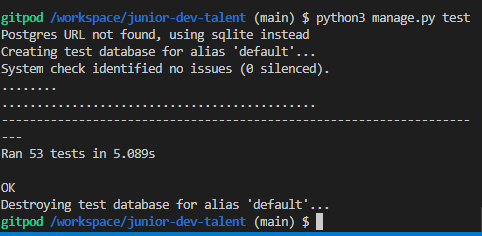

# Unit testing

[Click here to go to the Readme file ](https://github.com/ccarabine/junior-dev-talent/blob/main/README.md)

For the BASKET app the following unit test were run on the views

### 1. Testing Views

    1. This test checks that the basket template is displayed 
    2. This test checks add product to basket and redirects to the products template with a status code of 302
    3. This test checks that the product course updates to quanity 2 and a message displayed
    4. Tests updating the basket item quantity from 2 to 0

___
## For the CHECKOUT app the following unit test were run on the views, models and views

### 1. Testing views

    1. This Test the url works when loading the page   
    2. This test the correct template loads on page load
    3. This test test an empty basket for checkout and verifies
       
### 2. Testing models
    1. test order model string method

### 3. Testing forms
    1.  This test tests the field "full name" is  required
        Checks the following
        1.form is not valid as full name is blank
        2. There is a comment_body key in the dic
        3. There is an error message
    2. This test tests the field "email" is  required
        Checks the following
        1.form is not valid as email is blank
        2. There is a comment_body key in the dic
        3. There is an error message
    3. This test tests the field "phone number" is  required
        Checks the following
        1.form is not valid as full name is blank
        2. There is a comment_body key in the dic
        3. There is an error message
    4. This test tests the field "street address 1" is  required
        Checks the following
        1.form is not valid as street address 1 is blank
        2. There is a comment_body key in the dic
        3. There is an error message
    5. This test tests the field "town or city" is  required
        Checks the following
        1.form is not valid as town or city is blank
        2. There is a comment_body key in the dic
        3. There is an error message
    6. This test tests the field "country" is  required
        Checks the following
        1.form is not valid as country is blank
        2. There is a comment_body key in the dic
        3. There is an error message
    7. This test tests the field correct country code is  required
        Checks the following
        1. form is not valid as country code is in correct
        2. There is a comment_body key in the dic
        3. There is an error message
    8. This test tests that is form is valid when all required fields are completed
    9. This test tests the field in the meta only display
        Checks the following
        1. The field is in meta
       
___
## For the FORUM app the following unit test were run on the views and models

### 1. Testing Models
    1. This test tests the topic model
    2. Test Topic model string method
    3. Test Topic model function friendly
    4. Test Post model string method 
    5. Test post model get_absolute_url
    6. Test Comment model string method
    7. Test comment model get url 

### 2. Testing views

    1. This test tests the topic is an instance of Topic model
    2. Test Topic model string method 
    3. Test Topic model function friendly
    4. Test Post model string method 
    5. Test get_absolute_url 
    6. Test Comment model string method
    7. Test get_absolute_url
    8. This test tests get a list of topics and verifies
       Checks the following
        1. that the status code is 200
        2. Templates used is forum.html
        3. Topic is Coding
    9. This test tests get a list of posts  when not logged in and verifies. Checks the following
        1. A not logged in user is redirected to the login page and
        2. the status code is 302
    10. This test tests get a list of posts  when logged in and verifies
        Checks the following
        A logged in user status code is 302 
    11. This test tests a user who is not logged in, can not create a post. Checks the following
        1. if the page redirects to the home page
        2. if the message is the same as the not logged in user
        3. that the status code is 302  - redirect
    12. This test tests a logged in user can create a post
        Checks the following
        1. the post the user created is equal to technical questions
        2. if the message is the same as post submitted
        3. the status code is 302  - redirect
        4. redirected back to the postdetail page
    13. This test tests an owner of a post can update their post
        Checks the following
        1. the updated title equals the title that the user typed in.
        2. if the message is the same as post submitted
        3. that the status code is 302  - redirect
        4. redirected back to the postdetail page
    14. This test tests a user who has not created the post can not
        edit the post
        Checks the following
        1. a different user that trys to edit a post with the title field
        is not saved
        2. the updated title is not equals to the post title that the user
        typed in.
        3. that the status code is 304  - Not modified status code

___

## For the HOME app the following unit test were run on the views

### 1. Testing Views
    
    1.Test the home view page
    2.Test the 404 error page, when incorrect url is entered

___

## For the PRODUCTS app the following unit test were run on the models and views
### 1. Testing Models
    1. Test Category model string method
    2. Test category model function friendly
       

### 2. Testing views
    1. This checks there are two users setup
    2. This tests that the url response  is success 200
    3. This tests the search term works and gets a 200 sucess code
    4. This tests the product details page 
    5. This tests admin can access the add a product page
    6. Test non superuser can't access the add a product page
___

## For the PROFILES app the following unit test were run on the views
### 1. Testing Models
    1. Test Category model string method
    2. Test category model function friendly

### 2. Testing views
    1. Test the url works when loading the page
    2. This test logins a  user and accesses the order history page for a test order and verifies
      
### 3. Testing forms
    1. This test tests fields are not required pm the userprofileform
    2. This test tests the name field is not required on the testskillform
    3. Test profile model string method

___
## Results from tests        
