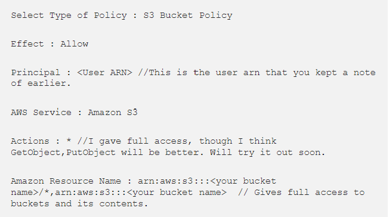

# Deployment steps
[Click here to go to the Readme file ](https://github.com/ccarabine/junior-dev-talent/blob/main/README.md#deployment) 
## Github 

This is the process I took to deploy my project from its GitHub repository to Github Pages:
1.	Open Github page up in the browser
2.	Login using your username and password
3.	Select "ccarabine/coronavirusforum" from repositories displayed on the left-hand side of screen
4.	Click "settings” displayed in the navigation toolbar menu
5.	Click “Pages” on the left-hand side navigation menu
6.	Select "main" in the dropdown under the Source heading
7.	Finally, click “save”
The live link is https://ccarabine.github.io/junior-dev-talent/

 

## Creating the project
**In the terminal**
| Step | Code |
| ------ | ------ |
| Install Django and gunicorn | `pip3 install django gunicorn`|
| Install supporting libraries | `pip3 install dj_database_url psycode2`|
| Create requirements file |  `pip3 freeze > requirements.txt`|
| Create project |  `django-admin startproject junior-dev-talent.`|
| Create App |  `python3 manage.py startapp home`|

 

**In settings.py**

| Step | Code |
| ------ | ------ |
| Add to installed apps  |  home |

 

**In the terminal**

Run the following commands

Migrate changes `python3 manage.py migrate`

Run server to test `python3 manage.py runserver`

 

**You should see the following message " The install worked successfully! Congratulations"**

 

## Create the Heroku app
| Step | Code |
| ------ | ------ |
| Create an account at heroku.com | Create new app - App name is "junior-dev-talent"  and Location is "Europe" and click on create an app|
|Add database to App resources |- Go to resources tab , click on the add-ons field and type Heroku postgres and click on submit order form |
|Copy DATABASE_URL|Under the settings tab, under config vars, click reveal config vars and copy the key and the value for the <code> DATABASE_URL</code>|

 

## Attach the database
**In gitpod**
| Step | Code |
| ------ | ------ |
|Create env.py on the top level directory|new file "env.py"|

**In eny.py** 

| Step | Code |
| ------ | ------ |
|Import os library| <code>Import os</code>|
|Set environment variables| <code>Import os</code>, set environment variables for <code> DATABASE_URL</code> and <code>SECRET_KEY</code>|

**In Heroku**

| Step | Code |
| ------ | ------ |
|Add secret key to config vars | add SECRET_KEY to config vars

 

## Prepare environment and settings.py file

**In settings.py**
| Step | Code |
| ------ | ------ |
|Reference env.py|  <code>From pathlib import Path </code>
||<code>Import os</code>|
||<code>Import dj_database_url</code>|
||<code>If os.path.isfile(“env.py”): </code>|
||<code>     Import env</code>||

| Step | Code |
| ------ | ------ |
|Remove the insecure secret key and replace |<code>SECRET_KEY = os.environ.get(‘SECRET_KEY’) </code>| 
| links to secret key variable on Heroku||

Replace DATABASES section with the following code

<code>if "DATABASE_URL" in os.environ:</code>

<code> DATABASES = { </code>

<code>"default": dj_database_url.parse(os.environ.get("DATABASE_URL"))</code>

<code>}</code>

<code>else:</code>

<code>print("Postgres URL not found, using sqlite instead")</code>

<code>DATABASES = {</code>

<code>"default": {</code>

<code>"ENGINE": "django.db.backends.sqlite3",</code>

<code>"NAME": os.path.join(BASE_DIR, "db.sqlite3"),</code>

<code>}</code>

<code>}</code>

**In the terminal**
Run the following commands

Migrate the database

`python3 manage.py migrate`

 

## Setting up Amazon S3 Bucket for serving Django Static and Media files.
- [Referenced from this article](https://medium.com/@manibatra23/setting-up-amazon-s3-bucket-for-serving-django-static-and-media-files-3e781ab325d5#id_token=eyJhbGciOiJSUzI1NiIsImtpZCI6IjMzZmY1YWYxMmQ3NjY2YzU4Zjk5NTZlNjVlNDZjOWMwMmVmOGU3NDIiLCJ0eXAiOiJKV1QifQ.eyJpc3MiOiJodHRwczovL2FjY291bnRzLmdvb2dsZS5jb20iLCJuYmYiOjE2NDE5MTk2MTAsImF1ZCI6IjIxNjI5NjAzNTgzNC1rMWs2cWUwNjBzMnRwMmEyamFtNGxqZGNtczAwc3R0Zy5hcHBzLmdvb2dsZXVzZXJjb250ZW50LmNvbSIsInN1YiI6IjEwMjc1Mzc5OTEwNDgzNzgwNDIwMiIsImVtYWlsIjoiY2NhcmFiaW5lMTJAZ21haWwuY29tIiwiZW1haWxfdmVyaWZpZWQiOnRydWUsImF6cCI6IjIxNjI5NjAzNTgzNC1rMWs2cWUwNjBzMnRwMmEyamFtNGxqZGNtczAwc3R0Zy5hcHBzLmdvb2dsZXVzZXJjb250ZW50LmNvbSIsIm5hbWUiOiJjaHJpcyBjYXJhYmluZSIsInBpY3R1cmUiOiJodHRwczovL2xoMy5nb29nbGV1c2VyY29udGVudC5jb20vYS9BQVRYQUp6djFRSjlFOVk2d2pNTlVTUjY5b182ZnhsTFdudHlFOHV0WW0wdj1zOTYtYyIsImdpdmVuX25hbWUiOiJjaHJpcyIsImZhbWlseV9uYW1lIjoiY2FyYWJpbmUiLCJpYXQiOjE2NDE5MTk5MTAsImV4cCI6MTY0MTkyMzUxMCwianRpIjoiMWE3NTIyNjM2NGEzZjlkYTE5MjQ3NDhmMDFjYzdhOTYzZmFjOGRmMyJ9.OZUh7a09XPmljYHK3i9OuR9xGhRvz1TZpsaPt1NL7lvgczRsX71KAutZbq32mN-955S3xqP4CGe58uTPQ67ZBDBUpXGWjD8Nojwh6NNwS5vI-69GWFRRSeAK0NNh29pjeiyhKoecV6U7cqXq9FlsiYSEFalU2kFGVY1-LSTHpQZOY1jtMOOB-ji4fpPe4PIEYcjnQL5mSna4bKLzFIuJ0Qh5U_ZHti7RMwHMI2cvey4OpmgryTFRbCzl5rdT4omfpE7ydlPMPhGq5makQ3mcJCPP0O69BxxDLgNXhcIeTY6GqFvc2x6hPNQxla_iP5azeGULDUaWkTwoOMm4Q3hvfA)

### Create a user using the IAM service. 
**This way you can restrict the access to the bucket. Each user will have its own access id and key.**

- Sign in with aws.amazon.com.
- From the “Services” dropdown select “IAM”.
- Click on “Users” and select “Add User”.
- Type the name of the user and make sure that “Programmatic access” is selected under “Access type” as you will need this to provide upload access for your S3 bucket.
- Click on “Next : Permissions”.
- Select “Attach existing policies directly”.
- From the list that appears select “AmazonS3FullAccess” and again click on “Next : Review”.
- Click on “Create User”
- This will create the user and generate an access id and key for the user. The id-key pair can only be downloaded at this step so do that by clicking on “Download .csv”. Keep it secret. Keep it safe. Click on “Close”
- From the Users Dashboard click on the user you have just created. Make a note of “User ARN”. You will be using this later.
- User has been set up. 

### Creating a S3 Bucket.
- From the Services dropdown select s3. This opens up the dashboard for the S3 buckets.
- Click on “Create Bucket”.
- Select the region you want.
- Give your bucket a name and click on next that brings you to the “Set Properties” tab. 
- Click on “Next” a couple more times and then click on “Create - Bucket” to create your bucket.
- Next you will have to define the policy for allowing restricted access to your bucket. 
- Click on the name of the bucket that you just created.
- Click on the Permissions tab located at the top.
- Since you have to set the permissions for access, click on “Bucket Policy”.
- On the bottom left of the modal that appears click on “AWS Policy Generator” which opens up the tool Amazon provides for quick policy generation.
- Now you have to generate two policy rules. 
- The first one is to allow our hosted website to access your files from the bucket. This will be as follows :

Click here to policy rules

- After setting the values as mentioned above click on “Add Statement”. Do not click on “Generate Policy” yet as you have to create a policy to allow the Django application to put files into the bucket on deployment. The policy will be as follows :

Click here to view add statement

- After setting the values mentioned above click on “Add Statement” and then “Generate Policy” . This will show you the policy which you can copy, paste in the dialogue box on S3 dashboard and click on Save.

- The last step for setting up the bucket access is providing the application hosted on Heroku, in this case, access to the bucket content. This can be done by setting up the CORS configuration. To do this click on the “ CORS Configuration” tab and click on Save. The default configuration will suffice.
You have the bucket access set up.

- Now all you have to do is set up your Django application to access the bucket which is fairly easy. 

**In the terminal**

Install Boto3 and DjangoStorages

Run the follow commands

`pip install Django-storages boto3`

`pip install freeze >> requirements.txt`

**In settings.py**
| Step | Code |
| ------ | ------ |
| add “storages” to the list of INSTALLED_APPS |
|| <code> INSTALLED_APPS = (</code>|
|| <code> ‘storages’,</code>|
|| <code>)</code>|

To set s3 as the place to store your files -add this code to settings.py

<code>STATIC_URL = "/static/"</code>
<code>STATICFILES_DIRS = (os.path.join(BASE_DIR, "static"),)</code>

<code>MEDIA_URL = "/media/"</code>
<code>MEDIA_ROOT = os.path.join(BASE_DIR, "media")</code>
<code>STATIC_ROOT = os.path.join(BASE_DIR, "staticfiles")</code>

 <code>if "USE_AWS" in os.environ:</code>
 <code>    # Cache control</code>
  <code>   AWS_S3_OBJECT_PARAMETERS = {</code>
 <code>        "Expires": "Thu, 31 Dec 2099 20:00:00 GMT",</code>
 <code>        "CacheControl": "max-age=94608000",</code>
 <code>    }</code>
 <code></code>
 <code>    # Bucket Config</code>
 <code>    AWS_STORAGE_BUCKET_NAME = os.environ.get("AWS_STORAGE_BUCKET_NAME")</code>
 <code>    AWS_S3_REGION_NAME = "us-east-1"</code>
 <code>    AWS_ACCESS_KEY_ID = os.environ.get("AWS_ACCESS_KEY_ID")</code>
 <code>    AWS_SECRET_ACCESS_KEY = os.environ.get("AWS_SECRET_ACCESS_KEY")</code>
 <code>    AWS_S3_CUSTOM_DOMAIN = f"{AWS_STORAGE_BUCKET_NAME}.s3.amazonaws.com"</code>
 <code></code>
 <code>    # Static and media files</code>
 <code>    STATICFILES_STORAGE = "custom_storages.StaticStorage"</code>
 <code>   STATICFILES_LOCATION = "static"</code>
 <code>   DEFAULT_FILE_STORAGE = "custom_storages.MediaStorage"</code>
 <code>   MEDIAFILES_LOCATION = "media"</code>
 <code></code>
 <code>   # Override static and media URLs in production</code>
 <code>    STATIC_URL = f"https://{AWS_S3_CUSTOM_DOMAIN}/{STATICFILES_LOCATION}/"</code>
 <code>    MEDIA_URL = f"https://{AWS_S3_CUSTOM_DOMAIN}/{MEDIAFILES_LOCATION}/"</code>

- It is good security practice to store your settings values in the environment rather than writing them down directly in the settings file. 

**In urls.py in the main project app**
| Step | Code |
| ------ | ------ |
|Add url configuration for your media files| <code> from Django.conf import settings</code>|
|| <code>Urlpatterns =[</code>|
|| <code>]+ static(settings.MEDIA_URL, document_root=settings.MEDIA_ROOT)</code>|

- And as a last step there should be a folder called static in the root of your application (same level as the manage.py file). 

**In the terminal**

Run the following commmands

`heroku config:set DISABLE_COLLECTSTATIC=1`

To disable collectstatic running automatically as your static folder is not yet present on the server and an error will be thrown regarding the same. You can run it manually using

`heroku run python manage.py collectstatic --noinput`

**In settings.py**

| Step | Code |
| ------ | ------ |
|Link file to the templates directory in Heroku | <code>TEMPLATES_DIR = os.path.join(BASE_DIR,”templates”) </code>|
|Place under the BASE_DIR||
|Change the templates directory tp TEMPLATES_DIR. Place with in templates array ||<code>DIRS: [TEMPLATES_DIR]</code>
|Add Heroku hostname to ALLOWED_HOSTS|<code>ALLOWED_HOSTS = ["junior-dev-talent.herokuapp.com", "localhost"]</code>|

**In Gitpod**

| Step | Code |
| ------ | ------ |
|Create 3 new folders on top level directory|media, static, templates|
|Create a Procfile on the top level directory|Add <code>web: gunicorn junior_dev_talent.wsgi</code>|
|Remove environment variables from env.py||

**In the terminal**
| Step | Code |
| ------ | ------ |
|Add, commit and push|`git add .`
||`git commit -m "Deployment Commit"`|
||`git push`

**In Heroku**
| Step | Code |
| ------ | ------ |
|Ensure all env variables are set| AWS_ACCESS_KEY_ID|
|| AWS_SECRET_ACCESS_KEY|
|| AWS_STORAGE_BUCKET_NAME|
||DATABASE_URL|
||EMAIL_HOST_PASSWORD_CK|
||EMAIL_HOST_USER_CK|
||STRIPE_PUBLIC_KEY|
||STRIPE_SECRET_KEY|
||STRIPE_WH_SECRET|
||SECRET_KEY|
||USE_AWS|

| Step | Code |
| ------ | ------ |
|Deploy content manually through heroku|Github as deployment method on the main branch|

 

## Final deployment
**Put in settings.py**
| Step | Code |
| ------ | ------ |
|The debug flag must be set  to False|<code>DEBUG=FALSE</code>
|Add|<code> X_FRAME_OPTIONS = 'SAMEORIGIN'|

**Put in the terminal**
| Step | Code |
| ------ | ------ |
|Add, commit and push|`git add .`
||`git commit -m "Deployment Commit"`|
||`git push`

**In Heroku**
| Step | Code |
| ------ | ------ |
|Remove Disable collectstatic in config vars ||
|Deploy|Go to the deploy tab and scroll  down to the end and deploy our branch.|

View the build log as well just  to make sure that everything works okay.
It says that our app  has been deployed to Heroku.

 

# Making a local clone

**In GitHub**
- Go back to your repository 
– Click on the repository name on the top left
- Click on the code button and copy the url under HTTPS
https://github.com/ccarabine/junior-dev-talent.git. This will clone your repository
-In your local IDE open Git Bash. Change the current working directory to the location where you want the cloned directory to be made

**In Gitpod**
 
**In the Terminal**

- Type `git clone` and then paste the URL  `https://github.com/ccarabine/junior-dev-talent.git` Press Enter. Your local clone will be created
- Create an env.py file(do not commit this file to source control) in the root folder in your project, and add in the relevant key and value pairs, and ensure you enter the correct key values 
<code>
os.environ.setdefault("AWS_ACCESS_KEY_ID", TO BE ADDED BY USER) 
os.environ.setdefault("AWS_SECRET_ACCESS_KEY", TO BE ADDED BY USER) 
os.environ.setdefault("DATABASE_URL", TO BE ADDED BY USER)
os.environ.setdefault("SECRET_KEY", TO BE ADDED BY USER) 

os.environ.setdefault("STRIPE_PUBLIC_KEY", TO BE ADDED BY USER) 
os.environ.setdefault("STRIPE_SECRET_KEY", TO BE ADDED BY USER) 
os.environ.setdefault("STRIPE_WH_SECRET", TO BE ADDED BY USER) 

os.environ.setdefault("EMAIL_HOST_PASS", TO BE ADDED BY USER) 
os.environ.setdefault("USE_AWS", TO BE ADDED BY USER) 
</code> 

- Install the relevant packages as per the requirements.txt file `pip install -r requirements.txt`
- In the settings.py ensure the connection is set to either the Heroku postgres database or the local sqllite database
- Ensure debug is set to true in the settings.py file for local development
- Add localhost/127.0.0.1 to the ALLOWED_HOSTS variable in settings.py
- Run `python3 manage.py showmigrations` to check the status of the migrations
- Run `python3 manage.py migrate` to migrate the database
- Run `python3 manage.py createsuperuser` to create a super/admin user
- Start the application by running `python3 manage.py runserver`
- Open the application in a web browser,  http://127.0.0.1:8000/
