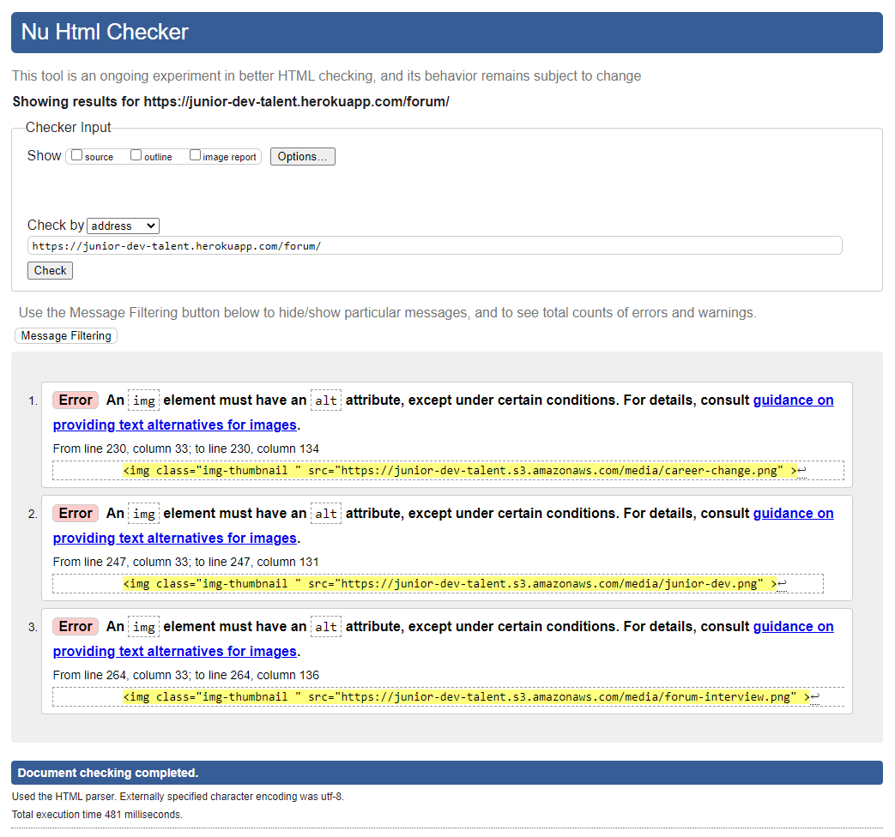
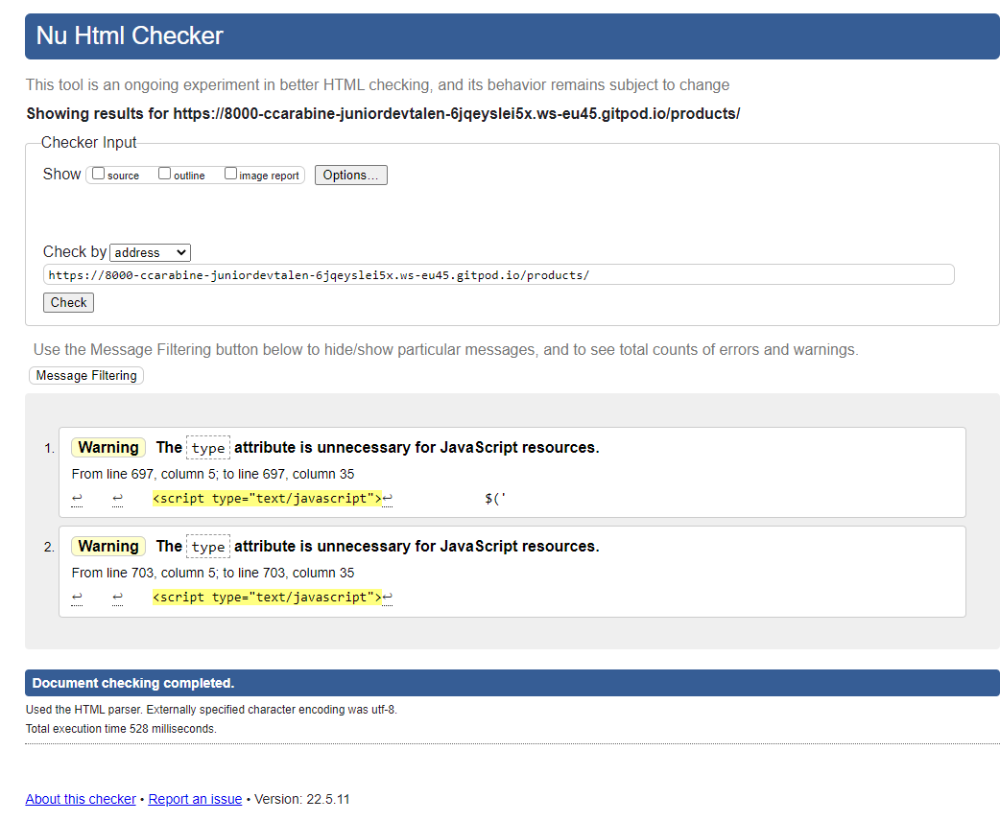
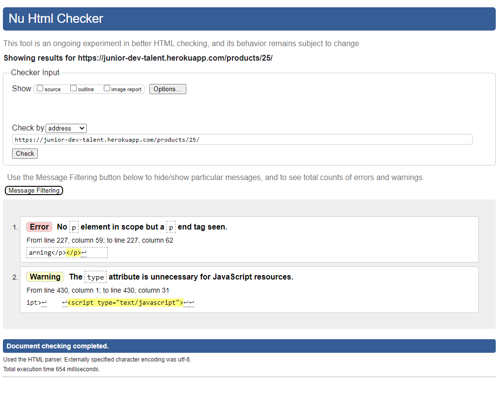
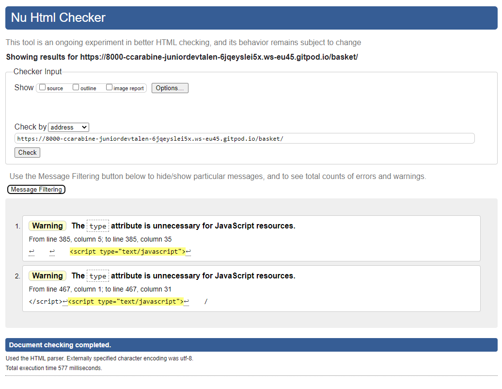
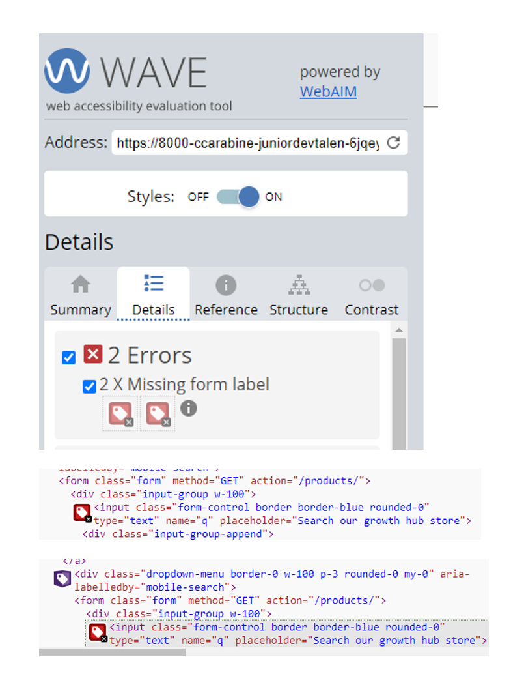
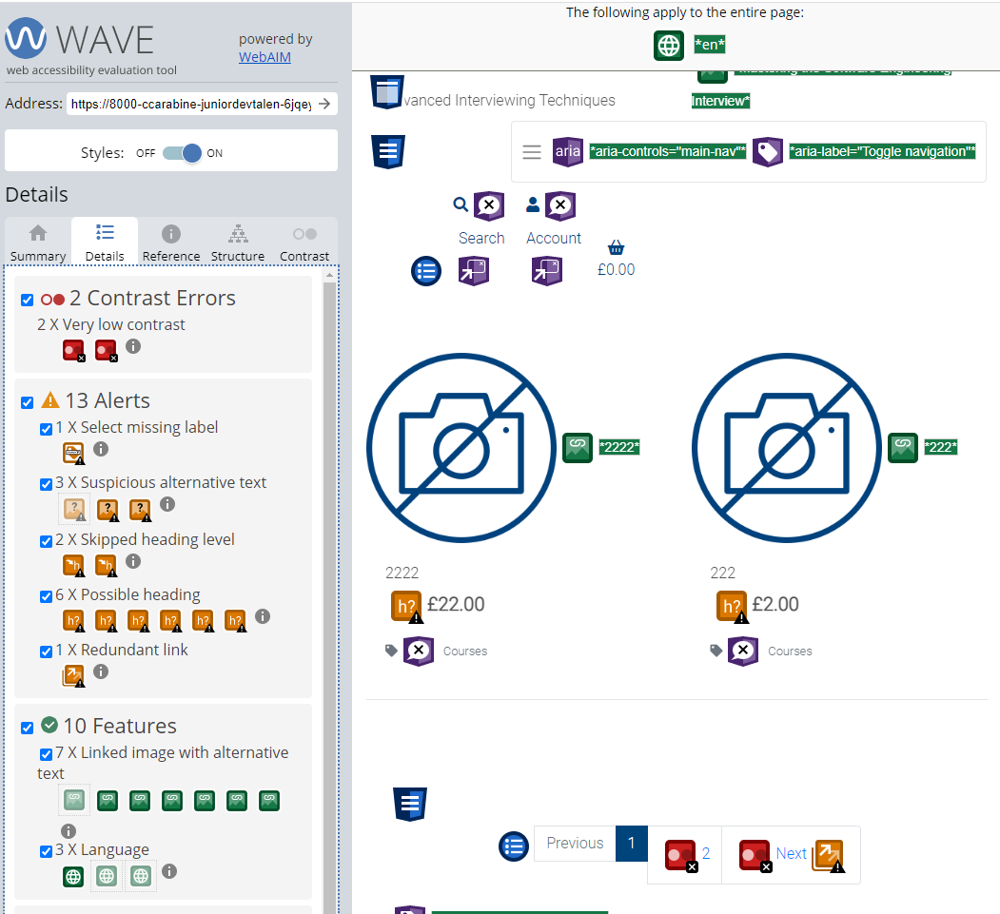
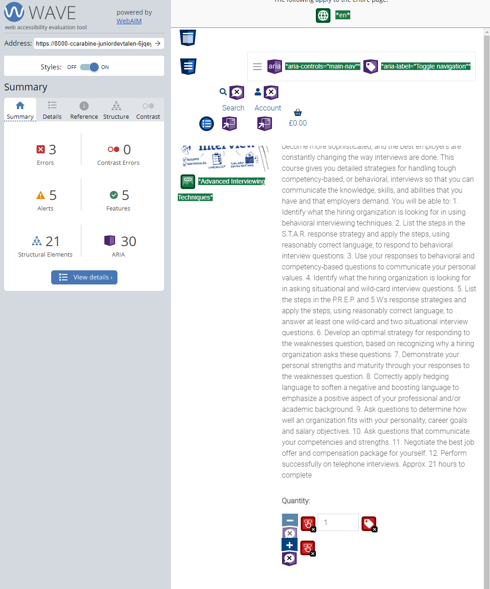
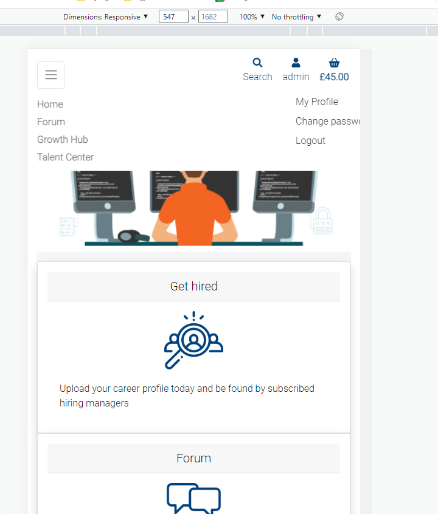

z## Known issues during development </a>

[Click here to go to the Readme file ](https://github.com/ccarabine/junior-dev-talent/blob/main/readme.md#known-issues)

### During development, the following issues were identified by user feedback and corrected
---

## Known issues during testing 

### HTML vaildation issues 

#### **Forum**

Click here to view image 

- **Issue 1,2,3 :** 

    *An img element must have an alt attribute*

- **Corrective Action:** 

    Add alt attribute alt="{{topic.name}} image">

#### **Subscription**

Click here to view image 

- **Issue 1 :** 

    *Bad value button for attribute type on element*

- **Corrective Action:** 

    Remove type

#### **Product**

Click here to view image 

- **Issue 1 & 2:** 

    *The type attribute is unnecessary for JavaScript resources.*

- **Corrective Action:** 

    Remove type

#### **Product detail**

Click here to view image 

- **Issue 1:** 

    *No p element in scope but a p end tag seen*

- **Corrective Action:** 

    Remove close p tag

- **Issue 2:** 

    *The type attribute is unnecessary for JavaScript resources.*

- **Corrective Action:** 

    Remove type

#### **Basket**

Click here to view image 

- **Issue 1 & 2:** 

    *The type attribute is unnecessary for JavaScript resources.*

- **Corrective Action:** 

    Remove type

___

## Wave accessibility vaildation issues 

#### **Index**

Click here to view image 

- **Issue 1 & 2:** 

    Missing form labels
    

- **Corrective Action:** 

    Add aria label

#### **Product**

Click here to view image 

- **Issue 1 & 2:** 

    low contract errors on pagination numbers
    

- **Corrective Action:** 

    Change to text black

#### **Product detail**

Click here to view image 

- **Issue 1:** 

    1. 1x mising form label
    2. 2 x empty button
    

- **Corrective Action:** 

   1. Add aria label
   2. Add aria labels

___
   

## Known issues during user story testing

- **Issue 1 :** 

    SM/MD - on home page
    On the account dropdown, "change password" doesn't show whole word

Click here to view image 

 

- **Corrective Action:** 

    Added media query to reduce font size on max width 576
___
