z## Known issues during development </a>

[Click here to go to the Readme file ](https://github.com/ccarabine/junior-dev-talent/blob/main/readme.md#known-issues)

### During development, the following issues were identified by user feedback and corrected
---

## Known issues during testing 

### HTML vaildation issues 

#### **Forum**

Click here to view image 

- **Issue 1,2,3 :** 

    *An img element must have an alt attribute*

- **Corrective Action:** 

    Add alt attribute alt="{{topic.name}} image">

#### **Subscription**

Click here to view image 

- **Issue 1 :** 

    *Bad value button for attribute type on element*

- **Corrective Action:** 

    Remove type

#### **Product**

Click here to view image 

- **Issue 1 & 2:** 

    *The type attribute is unnecessary for JavaScript resources.*

- **Corrective Action:** 

    Remove type

#### **Product detail**

Click here to view image 

- **Issue 1:** 

    *No p element in scope but a p end tag seen*

- **Corrective Action:** 

    Remove close p tag

- **Issue 2:** 

    *The type attribute is unnecessary for JavaScript resources.*

- **Corrective Action:** 

    Remove type

#### **Basket**

Click here to view image 

- **Issue 1 & 2:** 

    *The type attribute is unnecessary for JavaScript resources.*

- **Corrective Action:** 

    Remove type

___

## Wave accessibility vaildation issues 

#### **Index**

Click here to view image 

- **Issue 1 & 2:** 

    Missing form labels
    

- **Corrective Action:** 

    Add aria label

#### **Product**

Click here to view image 

- **Issue 1 & 2:** 

    low contract errors on pagination numbers
    

- **Corrective Action:** 

    Change to text black

#### **Product detail**

Click here to view image 

- **Issue 1:** 

    1. 1x mising form label
    2. 2 x empty button
    

- **Corrective Action:** 

   1. Add aria label
   2. Add aria labels

___
   

## Known issues during user story testing

- **Issue 1 :** 

    SM/MD - on home page
    On the account dropdown, "change password" doesn't show whole word

Click here to view image 

 

- **Corrective Action:** 

    Added media query to reduce font size on max width 576
___

- **Issue 2 :** 

    SM/MD/LG - on footer
    When the user enters their email address to subscribe to the newsletter, and clicks join, 
    there is no feedback

Click here to view image 

 

- **Corrective Action:** 

    Add success code
    [code](../images/testing/user_story/issues/test2_2a_issues.png)
___

- **Issue 3 :** 

    SM/MD/LG - on subscription page Feature 5.1
    Card footer is displayed and not needed. Doesn't look good

Click here to view image 

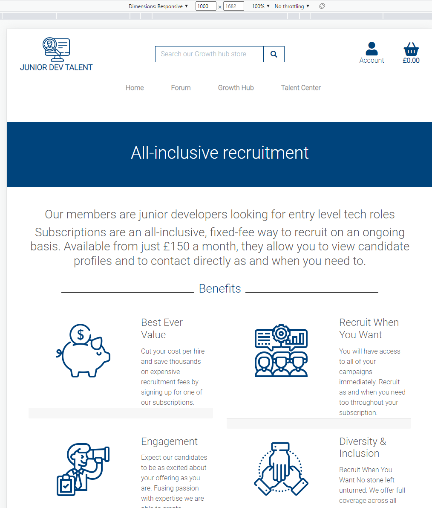

 

- **Corrective Action:** 

    Remove card-footer
___
- **Issue 4 :** 

    SM/MD/LG - on topic delete page Feature 4
    Footer doesn't stay at bottom of page

Click here to view image 

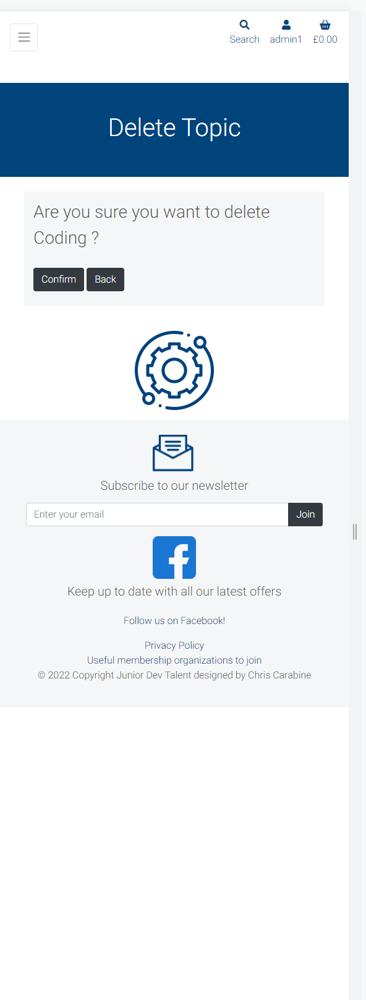

 

- **Corrective Action:** 

Reorganise code and put h-100 in correct place
___

- **Issue 5 :** 

    SM/MD/LG - on forum, post,  update post & comment as superuser Feature 5.7
    Page not found

Click here to view image 

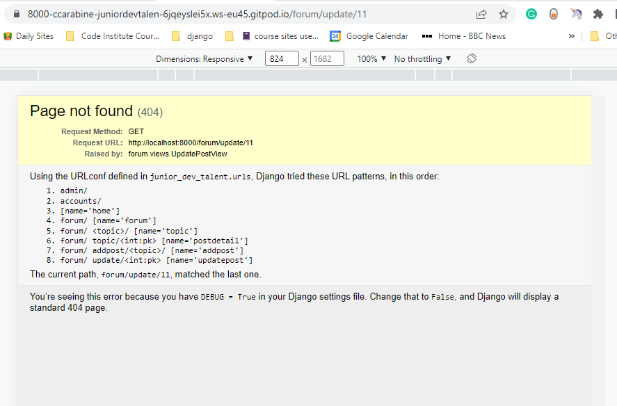

 

- **Corrective Action:** 

Removed the code to filter the owner and changed to update function

Click here to view image 

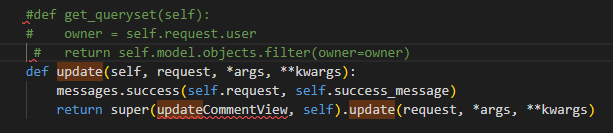

___

- **Issue 6 :** 

    SM/MD/LG - on post, delete comment, cancel. should go back to the comment Feature 6.3.1
    Page not found

Click here to view image 

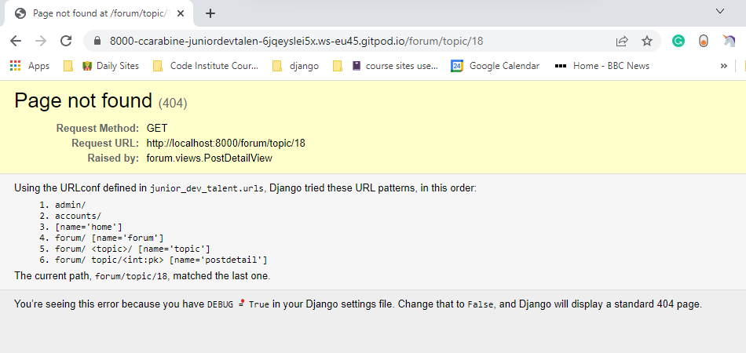

 

- **Corrective Action:** 

Redirect to forum

___

- **Issue 7 :** 

    SM/MD/LG - on profile_type page Feature 7.1
    Footer doesn't stay at bottom of page

Click here to view image 

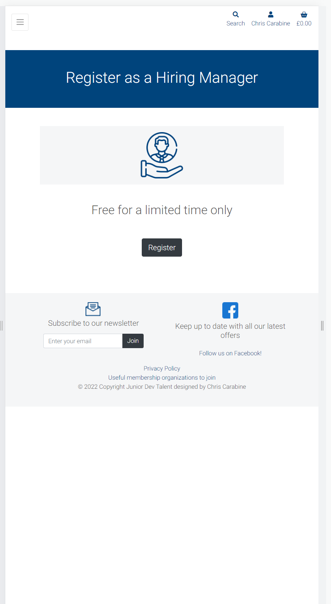

 

- **Corrective Action:** 

add h-100 to container
___

- **Issue 8 :** 

    SM/MD/LG - on profile_type page Feature 7.1.1
    1. Profiles empty displayed
    2. Footer doesn't stay at bottom of page

Click here to view image 

 

- **Corrective Action:** 
1. Add if statement, so if the full name isn't filled out the profile doesn't show
2. Add h-100 to container
___

- **Issue 9 :** 

    SM/MD/LG - on profile_type page Feature 7.1.2
    1. Footer doesn't stay at bottom of page

Click here to view image 

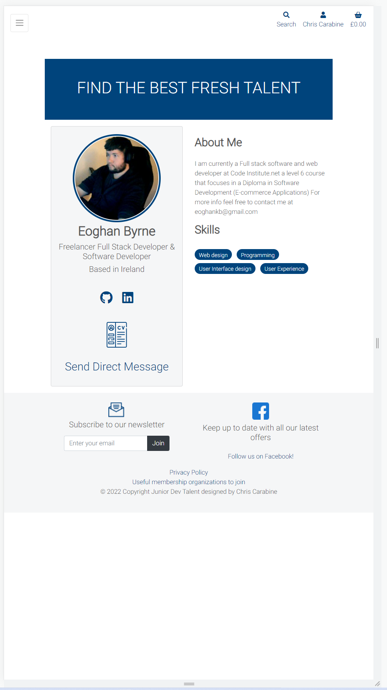

 

- **Corrective Action:** 
1. Add h-100 to container
___

- **Issue 10 :** 

    SM/MD/LG - on profile_type page Feature 7.1.5.4
    1. Footer doesn't stay at bottom of page

Click here to view image 

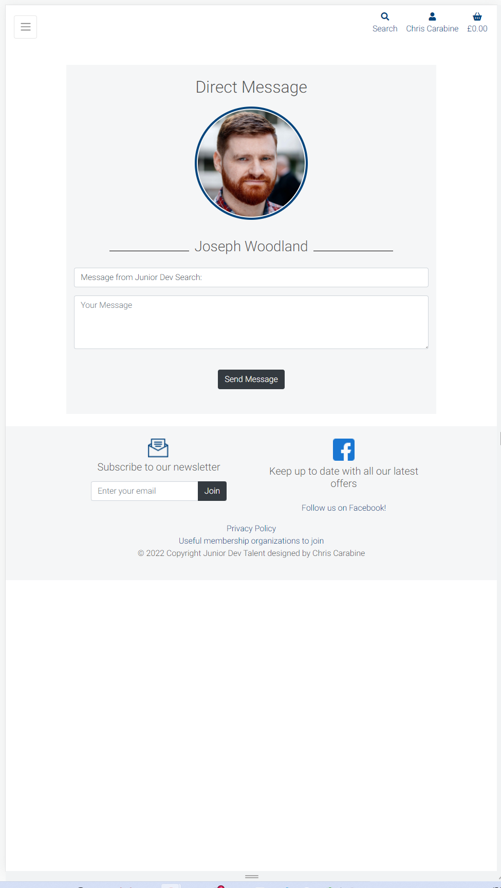

 

- **Corrective Action:** 
1. Add h-100 to container
___

- **Issue 11 :** 

    LG - on product detail page Feature 8.2
    1. Add to basket button going on next line on lg

Click here to view image 

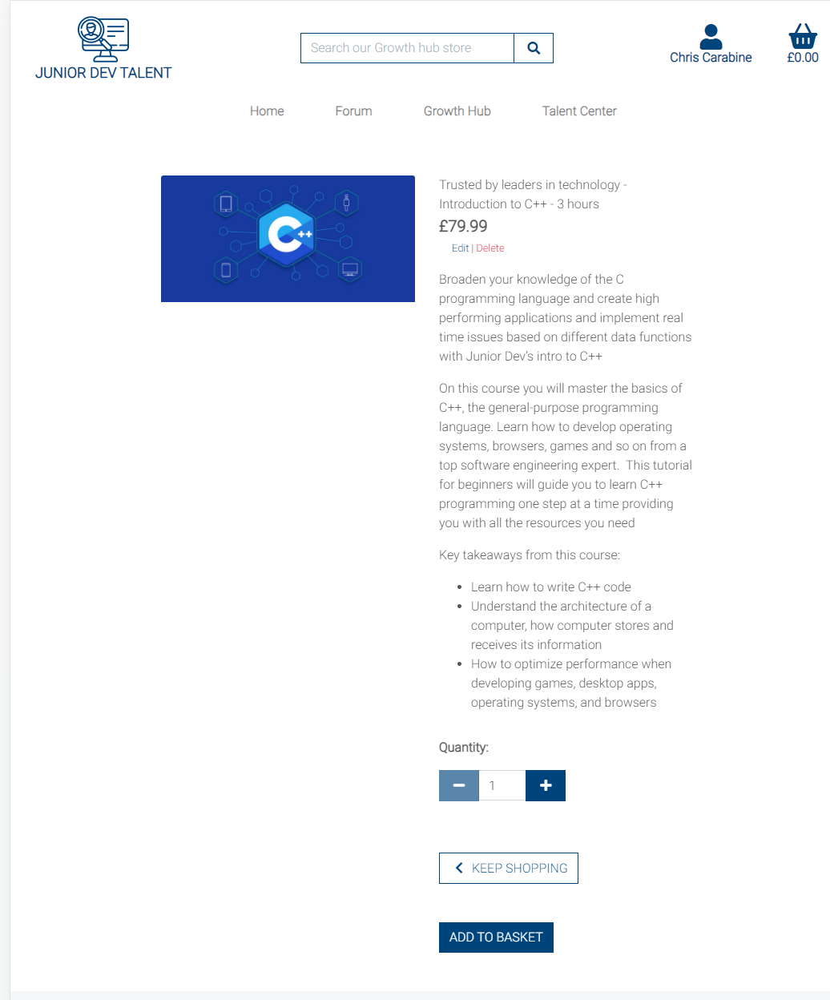

 

- **Corrective Action:** 
1. Change col-4 to 6
___

- **Issue 12 :** 

    LG - on basket page Feature 9.1
    1. plus sign has no border

Click here to view image 

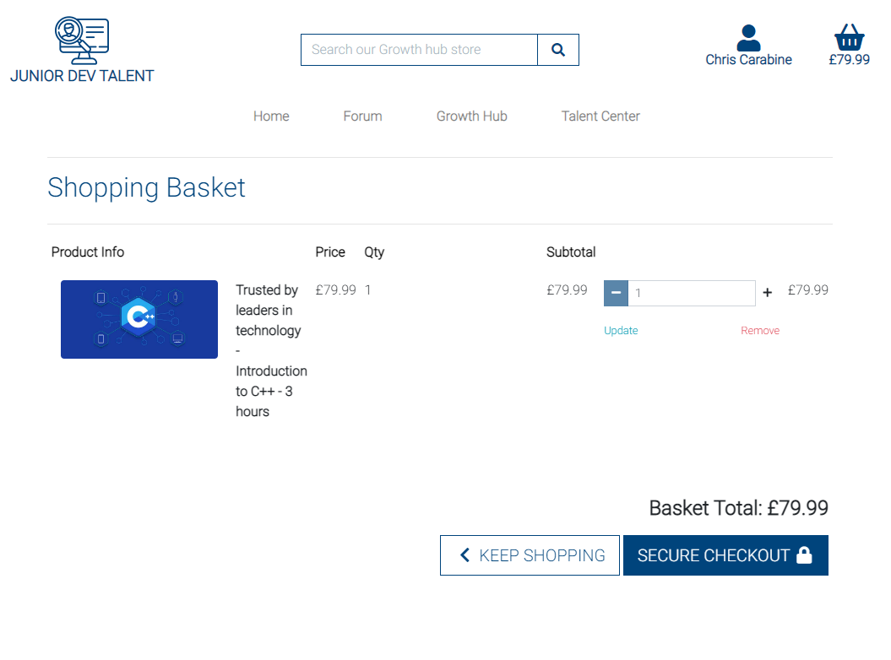

 

- **Corrective Action:** 
1. changed class from btn-black to btn-blue
___

- **Issue 13 :** 

    Email confirmation feature 10.2.2.9a
    1. Has dollar sign instead of pound sign on the total

Click here to view image 

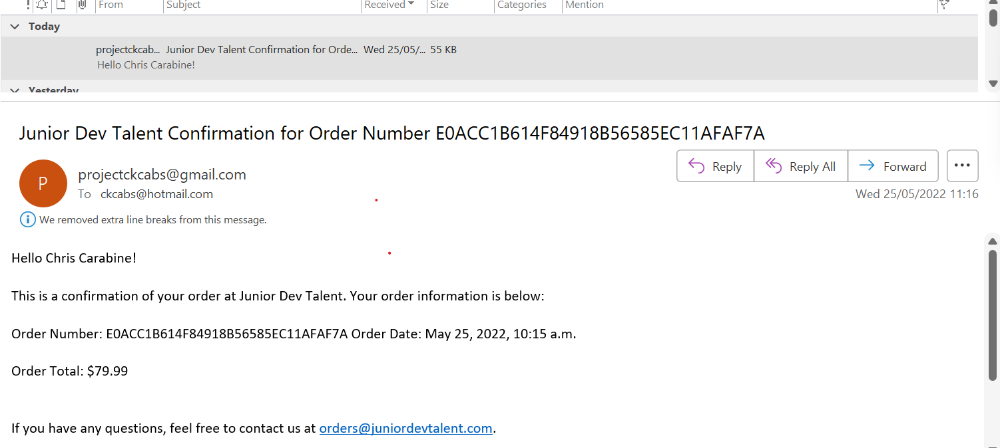

 

- **Corrective Action:** 
1. Changed to pound sign
___

- **Issue 14 :** 

    SM/MD/LG - on delete account page Feature 11.7
    Footer doesn't stay at bottom of page

Click here to view image 

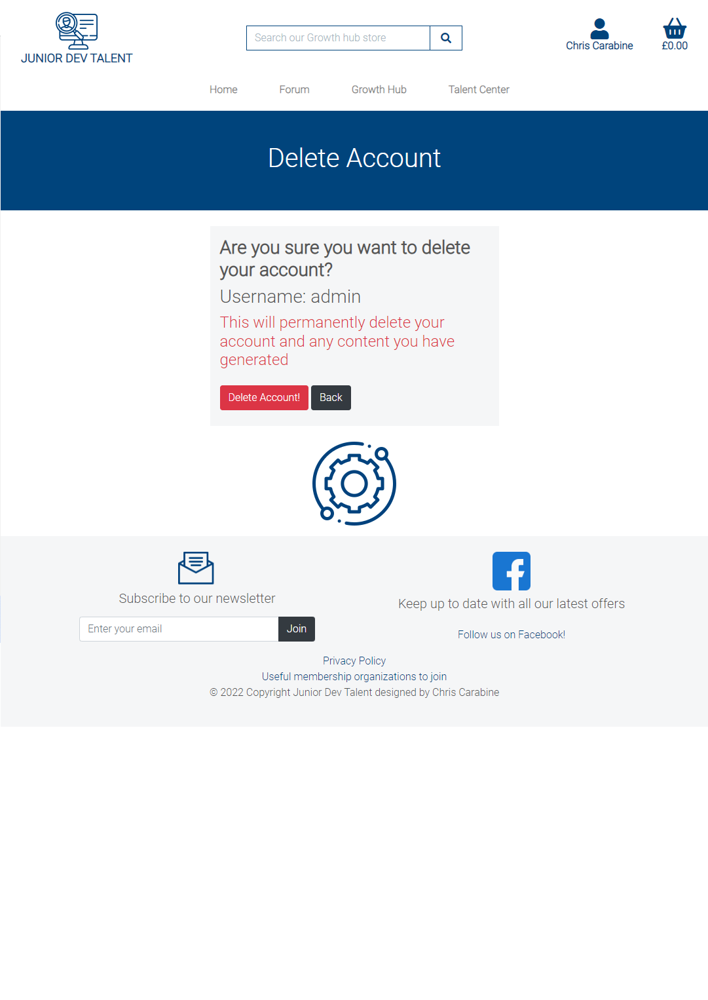

 

- **Corrective Action:** 

Reorganise code and put h-100 in correct place
___

- **Issue 15 :** 

    SM/MD/LG - on delete account page, when the user clicks on delete acccount, no success message is displayed Feature 11.7.2

Click here to view image 

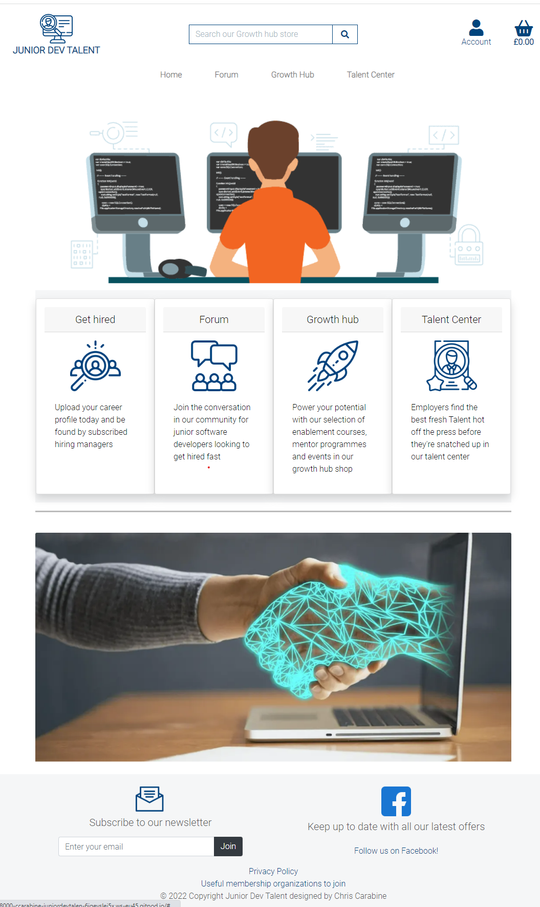

 

- **Corrective Action:** 

Add delete function success message in the class based view
___

