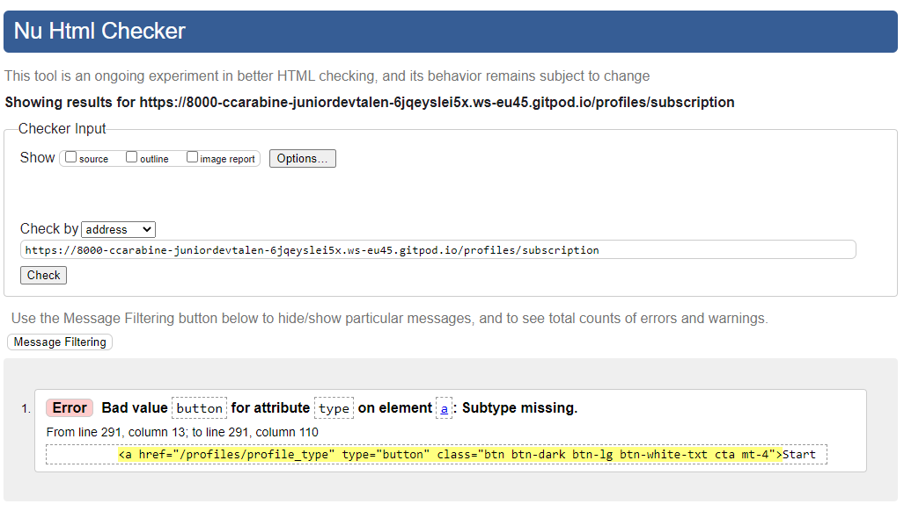

z## Known issues during development </a>

[Click here to go to the Readme file ](https://github.com/ccarabine/junior-dev-talent/blob/main/readme.md#known-issues)

### During development, the following issues were identified by user feedback and corrected
# EXAMPLE
 - **Issue 1:** 
 
    *In production, summernote wysiwyg not displaying icons*

-	**Corrective Action:** 
    *Add header link and js and uploaded fonts to css*
    
    https://stackoverflow.com/questions/36034892/icons-not-showing-with-summernote-rails
    
    *Added configuration to cors in s3 bucket"*

Click here to view image 

___

---

## Known issues during testing 

### HTML vaildation issues 

#### **Forum**

Click here to view image 

- **Issue 1,2,3 :** 

    *An img element must have an alt attribute*

- **Corrective Action:** 

    Add alt attribute alt="{{topic.name}} image">

#### **Subscription**

Click here to view image 

- **Issue 1 :** 

    *Bad value button for attribute type on element*

- **Corrective Action:** 

    Remove type

#### **Product**

Click here to view image 

- **Issue 1 & 2:** 

    *The type attribute is unnecessary for JavaScript resources.*

- **Corrective Action:** 

    Remove type

#### **Product detail**

Click here to view image 

- **Issue 1:** 

    *No p element in scope but a p end tag seen*

- **Corrective Action:** 

    Remove close p tag

- **Issue 2:** 

    *The type attribute is unnecessary for JavaScript resources.*

- **Corrective Action:** 

    Remove type

#### **Basket**

Click here to view image 

- **Issue 1 & 2:** 

    *The type attribute is unnecessary for JavaScript resources.*

- **Corrective Action:** 

    Remove type

___

## Wave accessibility vaildation issues 

#### **Index**

Click here to view image 

- **Issue 1 & 2:** 

    Missing form labels
    

- **Corrective Action:** 

    Add aria label

#### **Product**

Click here to view image 

- **Issue 1 & 2:** 

    low contract errors on pagination numbers
    

- **Corrective Action:** 

    Change to text black

#### **Product detail**

Click here to view image 

- **Issue 1:** 

    1. 1x mising form label
    2. 2 x empty button
    

- **Corrective Action:** 

   1. Add aria label
   2. Add aria labels

___
   
## PEP8 validation issues 
#### **apps.py**

Click here to view image 

- **Issue 1 :** 

    expect 2 lines
    

- **Corrective Action:** 

   Added a line

___

## Lighthouse validation issues 
#### **Accessibility home page mobile**

Click here to view image 

- **Issue 1 :** 
    Aria attributes do not match their roles
    
- **Corrective Action:** 
    Added aria label to mobile-search

___

#### **SCO -home page mobile**

Click here to view image 

- **Issue 1 :** 
    interactive elements - privacy policy link does not have enough space around them
    

- **Corrective Action:** 
    Added margin bottom to the links

___

___

## Known issues during user story testing

- **Issue 1 :** 

    Mobile - on home page
    On the account dropdown, "change password" doesn't show on drop down menu

Click here to view image 

 

- **Corrective Action:** 

    Added code to mobile-top-header
___
